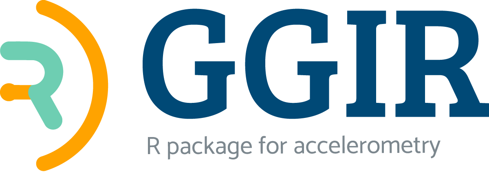

## Getting started:
The package [documentation](https://wadpac.github.io/GGIR/) provides extensive documentation on GGIR and its functionalities.

## Contribution guidelines:
We always welcome contributions to the package.
If you want to contribute to the development of GGIR, have a look at the [contribution guidelines](https://github.com/wadpac/GGIR/blob/master/CONTRIBUTING.md).

### Images usaged
The copyright of the GGIR logo as contained in the file vignettes/GGIR-MASTERLOGO-RGB.png lies with Accelting (Almere, The Netherlands), please contact v.vanhees@accelting.com to ask for permission to use this logo.

All other images in this repository are released under the Creative Commons Attribution 4.0 International (CC BY 4.0) license.