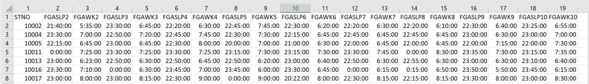

```{r setup, include=FALSE}
knitr::opts_chunk$set(echo = TRUE)
```

# Introduction

## What is GGIR?

[GGIR](https://CRAN.R-project.org/package=GGIR) is an R-package to process multi-day raw accelerometer data for physical activity and sleep research. The term _**raw**_ in raw accelerometry refers to data being expressed in m/s<sup>2</sup> or gravitational acceleration as opposed to the previous generation accelerometers which stored data in accelerometer brand specific units. The signal processing includes automatic calibration, detection of sustained abnormally high values, detection of non-wear and calculation of average magnitude of dynamic acceleration based on a variety of metrics. Next, GGIR uses this information to describe the data per day of measurement or per measurement, including estimates of physical activity, inactivity and sleep. This vignette provides a general introduction to GGIR, additionally you can find a general [introduction video](https://youtu.be/RuFBCAqFJ2M) and a [mini-tutorial](https://youtu.be/S8YPTrYNWdU) on YouTube.

## Who has been using GGIR?

GGIR is increasingly being used by a number of research groups acros the world. A non-exhaustive overview of academic publications related to GGIR can be found [here](https://github.com/wadpac/GGIR/wiki/Publication-list).

A non-exhaustive list of academic institutes that have been using GGIR:

**United Kingdom:** University College London, Exeter University, Newcastle University, Edge Hill University, University of Cambridge, University of Chester, Edinburgh Napier University, University of Birmingham, Liverpool John Moores University | **United States:** University College San Diego, Iowa State University, University of Southern California, University of Michican, West Virginia University, Arizona State University, University of Utah, National Institute of Health | **The Netherlands:** Erasmus Medical Centre Rotterdam, VU University Medical Centre, Leiden University Medical Centre | **France:** French Institute for Health and Medical Research, Institute of Myology, University  of Dijon, University of Montpellier | **Brazil:** Federal University of Pelotas | **Australia:** Newcastle University, Australian Catholic University, University of Sydney, Queensland University of Technology, University of Western Australia | **Spain:** University of Granada | **Norway:** University of Oslo | **Sweden:** University of Lund | **Switszerland:** Centre Hospitalier Universitaire Vaudois | **Germany:** Technische Universität Dresden, Technical University Munich

## Acknowledgements

R package GGIR would not have been possible without the support of the following people, institutions, and funders:

**People:**

- Dr. Vincent van Hees as main developer
- Dr. Evgeny Mirkes and Dr. Jing Hua Zhao provided code to enable binary accelerometer data to be read in R
- Dr. Zhou Fang contributed to a part of the code for the auto-calibration functionality
- Jairo Migueles helps maintain and improve the code
- Joe Heywood contributed code to correctly extract specific time segments with correct timestamps from an GENEActiv recording
- Dr. Severine Sabia tested and provided feedback on numerous aspects of the package
- Dr. Soren Brage provided supervision for a number of studies that formed the basis for GGIR

**Institutions:**

- The MRC Epidemiology Unit at the University of Cambridge, Cambridge, UK
- Movelab at Newcastle University, Newcastle upon Tyne, UK
- Netherlands eScience Center, Amsterdam, NL
- University of Exeter, Exeter, UK
- Centre for Longitudinal Studies, London, UK

**Funders:**

- Medical Research Council (MRC) grants MR/P012167/1 and MC_UU_12015/3
- Economic and Social Research Council (ESRC) grant ES/K005987 for ‘Millennium Cohort Study Sweep 6 (Age 14) Survey’ (MCS6)
- Biotechnology and Biological Sciences Research Council (BBSRC) and Unilever Discover Ltd funded a CASE studentship

## How can I contribute to the GGIR development?

The development version of GGIR can be found on [github](https://github.com/wadpac/GGIR), which is also where you will find guidance on how to contribute to the package development.

# Setting up your work environment

## Install R and RStudio

[Download and install R](https://cran.r-project.org/)

[Download and install RStudio](https://www.rstudio.com/products/rstudio/download2/) (optional, but recommended)

Download GGIR with its dependencies, you can do this with one command from the console command line:

```{R,eval=FALSE}
install.packages("GGIR", dependencies = TRUE)
```

## Prepare folder structure

1. GGIR works with the following accelerometer brands and formats:
    - [GENEActiv](https://www.geneactiv.org/) .bin and .csv
    - [ActiGraph](http://actigraphcorp.com/) .csv. Note for Actigraph users:
In ActiLife you have the option to export data with timestamps. Please do not do this as this causes memory issues. To cope with the absense of timestamps GGIR will re-caculate timestamps from the sample frequency and the start time and date as presented in the file header.
    - [Axivity](http://axivity.com/) .wav, .csv and .cwa
    - Genea (an accelerometer that is not available anymore, but which was used for some studies between 2007 and 2012) .bin and .csv
2. All accelerometer data that needs to be analysed should be stored in one folder, or subfolders of that folder.
3. Give the folder an appropriate name, preferable with a reference to the study or project it is related to rather than just 'data', because the name of this folder will be used later on as an identifier of the dataset.

## GGIR shell function

Copy paste the following code in a new R script (file ending with .R). It is a shell functions that will allow you to have all your decisions in one place without having to worry about separate scripts and configurations.

```{R,eval=FALSE}
library(GGIR)
g.shell.GGIR(#=======================================
             # INPUT NEEDED:
             mode=c(1,2,3,4,5),
             datadir="C:/mystudy/mydata",
             outputdir="D:/myresults",
             f0=1, f1=2,
             #-------------------------------
             # Part 1:
             #-------------------------------
             # Key functions: reading file, auto-calibration, and extracting features
             do.enmo = TRUE,             do.anglez=TRUE,
             chunksize=1,                printsummary=TRUE,
             #-------------------------------
             # Part 2:
             #-------------------------------
             strategy = 2,               ndayswindow=7,
             hrs.del.start = 0,          hrs.del.end = 0,
             maxdur = 9,                 includedaycrit = 16,
             winhr = c(5,10),
             qlevels = c(c(1380/1440),c(1410/1440)),
             qwindow=c(0,24),
             ilevels = c(seq(0,400,by=50),8000),
             mvpathreshold =c(100,120),
             bout.metric = 4,
             closedbout=FALSE,
             #-------------------------------
             # Part 3:
             #-------------------------------
             # Key functions: Sleep detection
             timethreshold= c(5),        anglethreshold=5,
             ignorenonwear = TRUE,
             #-------------------------------
             # Part 4:
             #-------------------------------
             # Key functions: Integrating sleep log (if available) with sleep detection
             # storing day and person specific summaries of sleep
             excludefirstlast = TRUE,
             includenightcrit = 16,
             def.noc.sleep = c(),
             loglocation= "C:/mydata/sleeplog.csv",
             outliers.only = TRUE,
             criterror = 4,
             relyonsleeplog = FALSE,
             sleeplogidnum = TRUE,
             colid=1,
             coln1=2,
             do.visual = TRUE,
             nnights = 9,
             #-------------------------------
             # Part 5:
             # Key functions: Merging physical activity with sleep analyses
             #-------------------------------
             threshold.lig = c(30), threshold.mod = c(100),  threshold.vig = c(400),
             boutcriter = 0.8,      boutcriter.in = 0.9,     boutcriter.lig = 0.8,
             boutcriter.mvpa = 0.8, boutdur.in = c(1,10,30), boutdur.lig = c(1,10),
             boutdur.mvpa = c(1),   timewindow = c("WW"),
             #-----------------------------------
             # Report generation
             #-------------------------------
             # Key functions: Generating reports based on meta-data
             do.report=c(2,4,5),
             visualreport=TRUE,     dofirstpage = TRUE,
             viewingwindow=1)
```

## Updating the GGIR shell input arguments

The function arguments need to be tailored to your experimental protocol. There are many function arguments you can specify which are explained in the package tutorial. GGIR is structured in 5 parts and the arguments to g.shell.GGIR can be structured accordingly:

- Part 1: Loads the data and stores derived features (aggregations) needed for the other parts. This is the time consuming part. Once this is done, parts 2-5 can be run (or re-run with different parameters in parts 2-5) relatively quickly.
- Part 2: Data quality analyses and low level description of signal features per day and per file. At this point a day is defined from midnight to midnight
- Part 3: Estimation of sustained inactivity and sleep periods, needed for input to Part 4 for sleep detection
- Part 4: o	Labels the sustained inactive periods detected in Part 3 as sleep, or daytime sustained inactivity, per night and per file
- Part 5: Derives sleep and physical activity characteristics by re-using information derived in part 2, 3 and 4. Total time in intensity categories, the number of bouts, time spent in bouts and average acceleration (overall activity) is calculated.

By looking up the corresponding functions g.part1, g.part2, g.part3, g.part4, and g.part5 you can see what arguments are possible. All of these arguments are also accepted by the shell function g.shell.GGIR, because g.shell.GGIR is nothing more than a wrapper around those functions.

Below I have highlighted a few of the key arguments you may want to be aware of. Please see the package manual for more detailed documentation:

### do.cal
Autocalibration is the process of investigating the acceleration signals for calibration error based on free-living data.  `do.cal` is a boolean argument to indicate whether autocalibration needs to be performed. If set to TRUE (default) GGIR will propose calibration correction factors to minimize calibration error.

### datadir
GGIR needs to know where your data is. It will detect automatically from what accelerometer brand the data comes from
and in what data format the information is stored

### strategy
Argument `strategy` allows you to give GGIR your knowledge about the study design:
  - strategy = 1: Exclude 'hrs.del.start' number of hours at the beginning and 'hrs.del.end' number of hours at the end of the measurement and never allow for more than 'maxdur' number of hours. These three parameters are set by their respective function arguments.
  - strategy = 2 makes that only the data between the first midnight and the last midnight is used for imputation.
  - strategy = 3 only selects the most active X days in the files. X is specified by argument 'ndayswindow'

### do.imp
GGIR detects when the accelerometer is not worn. Argument 'do.imp' indicates whether you want those missing periods to be
imputed by measurements from similar timepoints at different days of the measurment or not.

### loglocation
If you applied a sleeplog in your experiments then this can be used by GGIR to improve the sleep estimations. Argument
'loglocation' is the location of the spreadsheet (csv) with sleep log information. The spreadsheet needs to have the following structure: one column for participant id, and then followed by alternatingly one column for onset time and one column for waking
time (see example below). There can be multiple sleeplogs in the same spreadsheet. The first raw of the spreadsheet needs to be filled with column names, it does not matter what these column names are. Timestamps are to be stored without date as in hh:mm:ss. If onset corresponds to lights out or intention to fall asleep, then it is the end-users responsibility to account for this in the interpretation of the results.

```{r, out.width = "700px",echo=FALSE}

```


# Time for action: How to run your analysis?

## From the console

You can use

```source("pathtoscript/myshellscript.R")```

or use the Source button in RStudio if you use RStudio.

## In a cluster

It is possible to run GGIR on a computing cluster to process multiple files in parallel. The way I did it is as follows, please note that some of these commands are specific to the computing cluster you are working on. Please consult your local cluster specilist to tailor this to your situation. In my case, I had three files:

**submit.sh**

```{bash,eval=FALSE}
for i in {1..707}; do
    n=1
    s=$(($(($n * $[$i-1]))+1))
    e=$(($i * $n))
    qsub /home/nvhv/WORKING_DATA/bashscripts/run-mainscript.sh $s $e
done
```

**run-mainscript.sh**

```{bash,eval=FALSE}
#! /bin/bash
#$ -cwd -V
#$ -l h_vmem=12G
/usr/bin/R --vanilla --args f0=$1 f1=$2 < /home/nvhv/WORKING_DATA/test/myshellscript.R
```

**myshellscript.R**

```{R,eval=FALSE}
options(echo=TRUE)
args = commandArgs(TRUE)
if(length(args) > 0) {
  for (i in 1:length(args)) {
    eval(parse(text = args[[i]]))
  }
}
g.shell.GGIR(f0=f0,f1=f1,...)
```

You will need to update the ... in the last line with the arguments you used for g.shell.GGIR. Note that `f0=f0,f1=f1` is essential for this to work. The values of `f0` and `f1` are passed on from the bash script.

Once this is all setup you will need to call `bash submit.sh`
from the command line.
_**Note: Please make sure that you process one GGIR part at the same time on a cluster, because each part assumes that preceding parts have been ran. You can make sure of this by always specifying argument mode to a single part of GGIR. Once the analysis stops update argument mode to the next part until all parts are done.**_
The speed of the parallel processing is obviously dependent on the capacity of your computing cluster and the size of your dataset. I have been able to process all 4000 files from the Whitehall II Study in just a couple of hours.


# Inspecting the results
-	csv-spreadsheets with all the variables you need for physical activity, sleep and circadian rhythm research
-	Pdfs with on each page a low resolution plot of the data per file and quality indicators
- R objects with milestone data
-	Pdfs with a visual summary of the physical activity and sleep patterns as identified (see example below)

```{r, out.width = "700px",echo=FALSE}
knitr::include_graphics("reportexample.jpg")
```

## Output part 2

Part 2 generates:

- part2_summary.csv
- part2_daysummary.csv
- QC/data_quality_report.csv
- QC/plots to check data quality 1.pdf

### Dictionary of variables in part2_summary.csv

Variable   |   Description
------------------------ | ------------------------------------------------------
ID | Participant id
device_sn | Device serial number
bodylocation | Body location extracted from file header
filename | Name of the data file
start_time | Start time experiment
startday |	Day of the week on which measurement started
samplefreq |	Sample frequency (Hz)
device | Accelerometer brand, e.g. GENEACtiv
clipping_score | The Clipping score: Fraction of 15 minute windows per file for which the acceleration in one of the three axis was close to the maximum for at least 80\% of the time. This should be 0.
Measurement duration (days) |	-
complete_24hcycle | Completeness score: Fraction of 15 minute windows per 24 hours for which no valid data is available at any day of the measurement.
meas_dur_def_proto_day | measurement duration according to protocol (days):	Measurement duration (days) minus the hours that are ignored at the beginning and end of the measurement motived by protocol design
wear_dur_def_proto_day | wear duration duration according to protocol (days): So, if the protocol was seven days of measurement then wearing the accelerometer for 8 days and recording data for 8 days will still makethat the wear duration is 7 days
calib_err | Calibration error (static estimate)	Estimated based on all ‘non-movement’ periods in the measurement after applying the autocalibration.
calib_status | Calibration status: Summary statement about the status of the calibration error minimisation
ENMO | (only available if set to true in part1.R)	ENMO is the main summary measure of acceleration. The value presented is the average ENMO over all the available data normalised per 24 hour cycles, with invalid data imputed by the average at similar timepoints on different days of the week. In addition to ENMO it is possible to extract other acceleration metrics in part1.R (i.e. BFEN, HFEN, HFENplus)	See also [van Hees PLoSONE April 2013](http://journals.plos.org/plosone/article?id=10.1371/journal.pone.0061691) for a detailed description and comparison of these techniques.
pX_A_mg_0-24h |	This variable represents the Xth percentile in the distribution of short epoch metric value A of the average day. The average day may not be ideal. Therefore, the code also extracts similar variables per day and then takes the averages over days (see daysummary)
L5_A_mg_0-24 | Average of metric A during the least active five* hours in the day that is the lowest rolling average value of metric A. (* window size is modifiable in part2.R)
M5_A_mg_0-24 |  Average of metric A during the most active five* hours in the day that is the lowest rolling average value of metric A. (* window size is modifiable in part2.R)
L5hr_A_mg_0-24 | Starting time in hours and fractions of hours of L5_A_mg_0-24
M5hr_A_mg_0-24 | Starting time in hours and fractions of hours of M5_A_mg_0-24
1to6am_ENMO_mg | Average metric value ENMO between 1am and 6am
N valid WEdays | Number of valid weekend days
N valid WKdays | Number of valid week days
IS_interdailystability | inter daily stability
IV_intradailyvariability | intra daily variability
IVIS_windowsize_minutes | Sizes of the windows based on which IV and IS are calculated (note that this is modifiable)
IVIS_epochsize_seconds | size of the epochs based on which IV and IS are calculated (note that this is modifiable)
AD_... | All days (plain average of all available days, no weighting). The variable ... was calculated per day and then averaged over all the available days
WE_... | Weekend days (plain average of all available days, no weighting). The variable ... was calculated per day and then averaged over weekend days only
WD_... | Week days (plain average of all available days, no weighting). The variable ... was calculated per day and then averaged over week days only
WWE_... | Weekend days (weighted average)	The variable ... was calculated per day and then averaged over weekend days. Double weekend days are averaged. This is only relevant for experiments that last for more than seven days.
WWD_... | Week days (weighted average)	The variable ... was calculated per day and then averaged over week days. Double weekend days were averaged. This is only relevant for experiments that last for more than seven days)
WWD_MVPA_E5S_T100_ENMO | Time spent in moderate-to-vigorous based on 5 second epoch size and an ENMO metric threshold of 100
`WWE_MVPA_E5S_B1M80%_T100_ENMO` | Time spent in moderate-to-vigorous based on 5 second epoch size and an ENMO metric threshold of 100 based on a bout criteria of 100
`WE_[100,150)_mg_0-24h_ENMO` | Time spent between (and including) 100 mg and 150 (excluding 150 itself) between 0 and 24 hours (the full day) using metric ENMO data exclusion strategy (value=1, ignore specific hours; value=2, ignore all data before the first midnight and after the last midnight) |	A log of decision made in part2.R
n hours ignored at start of meas (if strategy=1) | number of hours ignored at the start of the measurement (if strategy = 1)	A log of decision made in part2.R
n hours ignored at end of meas (if strategy=1) | number of hours ignored at the end of the measurement (if strategy = 1).	A log of decision made in part2.R
n hours ignored at end of meas (if strategy=1) | number of days of measurement after which all data is ignored (if strategy = 1)	A log of decision made in part2.R
epoch size to which acceleration was averaged (seconds) | A log of decision made in part1.R
pdffilenumb |	Indicator of in which pdf-file the plot was stored
pdfpagecount |	Indicator of in which pdf-page the plot was stored


### Dictionary of variables in part2_daysummary.csv

Tis is a non-exhaustive list, because most concepts have been explained in summary.csv

Variables	| Description
------------------------ | ---------------------------------------------
ID | Participant id
filename | Name of the data file
calender_date | Timestamp and date on which measurement started
bodylocation | Location of the accelerometer as extracted from file header
N valid hours | Number of hours with valid data in the day
N hours	| Number of hours of measurement in a day, which typically is 24, unless it is a day on which the clock changes (DST) resulting in 23 or 25 hours. The value can be less than 23 if the measurement started or ended this day
weekday | Name of weekday
measurement | Day of measurement	Day number relative to start of the measurement
L5hr_ENMO_mg_0-24h | Hour on which L5 starts for these 24 hours (defined with metric ENMO)
L5_ENMO_mg_0-24h | Average acceleration for L5 (defined with metric ENMO)
`[A,B)_mg_0-24h_ENMO` |	Time spent in minutes between (and including) acceleration value A in mg and (excluding) acceleration value B in mg based on metric ENMO

## Output part 4

Part 4 generates the following output:

- part4_nightsummary_sleep_cleaned.csv
- part4_summary_sleep_cleaned.csv
- visualisation_sleep.pdf (optional)

The csv. files contain variables that are explained in the documentation of GGIR function [g.part4](https://CRAN.R-project.org/package=GGIR).

When input argument `do.visual` is set to TRUE GGIR can show the following visual comparison between the time window of being asleep (or in bed) according to the sleeplog and the detected sustained inactivity bouts according to the accelerometer data. This visualisation is stored in the results folder as visualisation_sleep.pdf.

Explanation of the image: Each line represents one night. Colors are used to dinstinguish definitions of sustianed inacitivty bouts (2 definitions in this case) and to indicate existence or absense of overlap with the sleeplog. When argument `outliers.only` is set to FALSE it will visualise all available nights in the dataset. If `outliers.only` is set to TRUE it will visualise only nights with a difference in onset or waking time between sleeplog and sustained inactivity bouts larger than the value of argument `criterror`.

This visualisation with outliers.only set to TRUE and critererror set to 4 was very powerful to identify entry errors in sleeplog data in van Hees et al PLoSONE 2015. We had over 25 thousand nights of data, and this visualisation allowed us to quickly zoom in on the most problematic nights to investigate possible mistakes in GGIR or mistakes in data entry.

```{r, out.width = "700px",echo=FALSE}
knitr::include_graphics("example_dovisual.jpg")
```


## Output part 5

The output of part 5 is dependent on the parameter configuration, it will generate as many output files as there are unique combination of the three thresholds provide. For example, the output could be:

- part5_daysummary_MM_L30M100V400_T5A5.csv
- part5_daysummary_WW_L30M100V400_T5A5.csv
- part5_personsummary_MM_L30M100V400_T5A5.csv
- part5_personsummary_WW_L30M100V400_T5A5.csv
- file summary reports/Report_nameofdatafile.pdf

Here is a beta-version of the variable dictionary, see GGIR package manual for more details

Variables	| Description
------------------------ | ---------------------------------------------
dur_nightsleep_min_pla | Sleep duration
XX_pla | plain average of variable XX across all days
XX_wei | weighted average of variable XX across all days
L5VALUE_pla	| Acceleration value for lowest 5hrs
M5VALUE_pla	| Acceleration value for highest 5hrs
Acc_day_mg_pla |	Average acceleration for daytime hours
ACC_night_mg_pla |	Average acceleration for night hours
ACC_nightandday_mg_pla | Average acceleleration for night and day combined
Dur_day_SIB_min_pla	| sustained inactivity bouts, are the periods of time during which the arm does not rotate at all for at least 5 or 10 minutes (depending on criteria used). This could be daytime sleep or the monitor not being worn for a very short period of time (these are not part of the inactivity bouts)
dur_day_OIN40_min_pla | Time spent below 40mg (OTHER INACTIVITY)
dur_day_LIG40_100_min_pla | Time spent in light (only unbouted)
dur_day_MOD100_400_min_pla | Time spent in moderate (only unbouted)
dur_day_VIG400_min_pla | Time spent in vigorous (only unbouted)
dur_MVPA_D10T100_min_pla | Bouts of at least 10 minutes of MVPA (i.e above 100mg)
dur_MVPA_D1T100_min_pla | 	Bouts between 1-9.99mins above MVPA
dur_INB_D10T40_min_pla | Bouts of 10mins INACTIVE (other inactivity or SIB)
dur_LIGB_D10T40_100_min_pla | Bouts of 10mins light
dur_LIGB_D1T40_100_min_pla | Bouts between 1-99.9mins light
dur_TSIBday_min_pla | T=unbouted+bouted. THIS IS DIFFERENT TO SIB, because TSIB is regardless of whether they contributed or not to inactivity (INB) bouts or not, whereas SIB is just time not part of INB. So would expect TSIB to be higher
dur_TOINday_min_pla | Unbouted and bouted time  spent in ‘other inactivity’
dur_TLIGday_min_pla | Unbouted and bouted time spent in light
dur_TMODday_min_pla |	Unbouted and bouted time spent in mod
dur_TVIGday_min_pla | Unbouted and bouted time spent in vig
dur_TINday_min_pla | Unbouted and bouted time spent in TOTAL INACTIVITY=TOIN+SIB
nonwear_perc_day_pla | non-wear time day
nonwear_perc_night_pla | non-wear time night
nonwear_perc_nightandday_pla | non-wear time night and day
sleep_efficiency_pla | Sleep efficiency
boutcriter.in_pla | 0.9-90% of the bout has to be above threshold. The reason that the criteria is 90% rather than 80%, is “somewhat arbitrary decision, but the idea was that if you allow for bouts of 30 minutes it would not make sense if you allow for breaks of 20% of the time(6 minutes!) this is why I used a more stringent criteria for the highest category”
boutcriter.lig_pla | 0.8-80% has to be above
boutcriter.mvpa_pla | 0.8-80% has to be above threshold

# Motivation and clarification

In this chapter I will try to collect motivations and clarification behind GGIR which may not have been clear from the existing publications

## Reproducibilty of GGIR analyses

Some tips to increase reproducibility of your findings:

1. When you publish your findings please remember to add the GGIR package version number. All of GGIR are archived by CRAN and available from the archive section on the package [website](https://CRAN.R-project.org/package=GGIR), so this will enable others to reproduce your analyses. GGIR has evolved over the years. To get a better understanding of how versions differ you should check the NEWS sections from the package [website](https://CRAN.R-project.org/package=GGIR).
2. Keep a copy of your scripts with the functions calls
3. Keep a copy of your milestone data
4. Try to be explicit in referring to variable names


## Auto-calibration

An acceleration sensor works on the principle that acceleration is captured mechanically and converted into an electrical signal. The relationship between the electrical signal and the acceleration is usually assumed to be linear, involving an offset and a gain factor. We shall refer to the establishment of the offset and gain factor as the sensor calibration procedure. Accelerometers are usually calibrated as part of the manufacturing process under non-movement conditions using the local gravitational acceleration as a reference. The manufacturer calibration can later be evaluated by holding each sensor axis parallel (up and down) or perpendicular to the direction of gravity; readings for each axis should be ±1 and 0 g, respectively. However, this procedure can be cumbersome in studies with a high throughput. Furthermore, such a calibration check will not be possible for data that have been collected in the past and for which the corresponding accelerometer device does not exist anymore. Techniques have been proposed that can check and correct for calibration error based on the collected triaxial accelerometer data in the participant's daily life without additional experiments, referred to as autocalibration. The general principle of these techniques is that a recording of acceleration is screened for nonmovement periods. Next, the moving average over the nonmovement periods is taken from each of the three orthogonal sensor axes and used to generate a three-dimensional ellipsoid representation that should ideally be a sphere with radius 1 g. Here, deviations between the radius of the three-dimensional ellipsoid and 1 g (ideal calibration) can then be used to derive correction factors for sensor axis-specific calibration error. This auto-calibration performed by GGIR uses this technique and a more detailed description and demonstration can be found in the published paper.

Reference:

- van Hees VT, Fang Z, Langford J, Assah F, Mohammad A, da Silva IC, Trenell MI, White T, Wareham NJ, Brage S. Autocalibration of accelerometer data for free-living physical activity assessment using local gravity and temperature: an evaluation on four continents. J Appl Physiol (1985). 2014 Oct 1;117(7):738-44. doi: 10.1152/japplphysiol.00421.2014. Epub 2014 Aug 7.
PMID: 25103964 [link](https://www.physiology.org/doi/10.1152/japplphysiol.00421.2014)

Key decisions to be made:

1.	Whether to apply auto-calibration or not (default and recommended setting is YES). You  can turn this off by changing do.call in g.shell.GGIR to do.call=FALSE.
2.	Other variables are probably best left in their default setting

Key output variables:

1. Variable value cal.error.end as stored in data_quality_report.csv or variable value calib_err in summary.csv. These should be less than 0.01 g (10mg).

## Non-wear detection
Accelerometer non-wear time was estimated on the basis of the standard deviation and the value range of the raw data from each accelerometer axis. Classification was done per 15 minute block and based on the characteristics of the 60 minute window centred at these 15 minutes. A block was classified as non-wear time if the standard deviation of the 60 minute window was less than 13.0 mg (1 mg = 0.00981 m·s−2) for at least two out of the three axes or if the value range, for at least two out of three axes, was less than 50 mg. The procedure for non-wear detection was modified in comparison to the procedure as applied in the 2011 PLoSONE publication [link](http://journals.plos.org/plosone/article?id=10.1371/journal.pone.0022922). Instead of 30-minute time windows 60-minute time windows were used to decrease the chance of accidently detecting short sedentary periods as non-wear time. The windows were overlapping (15 minute steps, window overlap of 45 minutes), which was done to improve the accuracy of detecting the boundaries of non-wear time as opposed to non-overlapping time windows. Inspection of unpublished data on non-wear classification by the algorithm as described in our published work indicated that the algorithm does not cope well with periods of monitor transportation per post. Here, long periods of non-wear are briefly interrupted by periods of movement, which are normally interpreted as monitor wear. Therefore, the algorithm was expanded with an additional stage in which the plausibility of “wear-periods” in-between non-wear periods is tested. Short periods of detected wear-time in-between longer periods of detected non-wear were classified as non-wear time based on the duration and the proportion of the duration relative to the bordering periods of detected non-wear-periods. The following criteria were derived from visual observation of various datasets using knowledge about study protocols. All detected wear-periods of less than six hours and less than 30% of the combined duration of their bordering non-wear periods were classified as non-wear. Additionally, all wear-periods of less than three hours and which formed less than 80% of their bordering non-wear periods were classified as non-wear. The motivation for selecting a relatively high criteria (< 30%) in combination with a long period (6hrs) and a low criteria (< 80%) in combination with a short period (3 hrs) was that long period are more likely to be actually related to monitor wear time. A visual model was created, see Figure 1. Here, units of time are presented in squares and marked grey if detected as non-wear time. Period C is detected as wear-time and borders to non-wear periods B and D, see Figure 1. If the length of C is less than six hours and C divided by the sum of B and D is less than 0.3 then the first criteria is met and block C is turned into a non-wear period.

```{r, out.width = "400px",echo=FALSE}
knitr::include_graphics("nonwearimage.jpg")
```

By visual inspection of >100 traces from a large observational study it turned out that applying this stage in three iterative stages allowed for improved classification of periods characterised by intermittent periods of non-wear and apparent wear. Further, an additional rule was introduced for the final 24 hours of each measurement. The final 24 hours are often considered the period in which the accelerometer is potentially taken off but moved because of transportation, e.g. by the mail service. All wear-periods in the final 24 hrs of each measurement shorter than three hours and preceded by at least one hour of non-wear time were classified as non-wear. Finally, if the measurement starts or ends with a period of less than three hours of wear followed by non-wear (any length) then this period of wear is classified as non-wear. These additional criteria for screening the beginning and end of the accelerometer file reflect the likelihood of movements that are involved when starting the accelerometer or downloading the data from the accelerometer.

Reference:

- van Hees VT, Gorzelniak L, Dean León EC, Eder M, Pias M, Taherian S, Ekelund U, Renström F, Franks PW, Horsch A, Brage S. Separating movement and gravity components in an acceleration signal and implications for the assessment of human daily physical activity. PLoS One. 2013 Apr 23;8(4):e61691. doi: 10.1371/journal.pone.0061691. Print 2013 [link](http://journals.plos.org/plosone/article?id=10.1371/journal.pone.0061691).

Key decisions to be made:

1.	Size of windows
2.	Whether to utilize the non-wear detection

Key output variables:

1.	Raw classification
2.	Non-wear duration
3.	Non-wear duration taking into account the protocol

## Clipping score

The acceleration signal was screened for ‘clipping’. If more than 50% of the data points in a 15 minute time window are higher than 7.5g (close to the maximal dynamic range of this sensor) the corresponding time period is considered as potentially corrupt data, which may be explained by the sensor getting stuck at its extreme value.

Reference:

- van Hees VT, Gorzelniak L, Dean León EC, Eder M, Pias M, Taherian S, Ekelund U, Renström F, Franks PW, Horsch A, Brage S. Separating movement and gravity components in an acceleration signal and implications for the assessment of human daily physical activity. PLoS One. 2013 Apr 23;8(4):e61691. doi: 10.1371/journal.pone.0061691. Print 2013 [link](http://journals.plos.org/plosone/article?id=10.1371/journal.pone.0061691)

## Why collapse information to epoch level?

Although many data points are collected we decide to only work with aggregated values (e.g. 1 or 5 second epochs) for the following reasons:

1.	Accelerometers are often used to describe patterns in metabolic energy expenditure. Metabolic energy expenditure is typically defined per breath or per minute (indirect calorimetry), per day (room calorimeter), or per multiple days (doubly labelled water method). In order to validate our methods against these reference standards we need to work with a similar time resolution.

2.	Collapsing the data to epoch summary measures helps to standardise for differences in sample frequency between studies

3.	There is little evidence that the raw data is an accurate representation of body acceleration. All scientific evidence on the validaty of accelerometer data is so far are based on epoch averages.

4.	Collapsing the data to epoch summary measures may help to average out different noise levels and make sensor brands more comparable

## Why use data metric ENMO?

In most studies I have been involved in we used metric ENMO (Euclidean Norm Minus One with negative values rounded to zero). In 2013 I wrote a paper in which I investigated different ways of summarising the raw acceleration data. In short, different metrics exist and there is very little literature to support the supperiority of any metric. As long as different studies use different metrics their findings will not be comparable. Therefore, the choice for metric ENMO is partially pragmatic. I am using ENMO because:

1.	Has demonstrated value in describing variance in energy expenditure, correlated with questionnaire data, able to describe patterns in physical activity
2.	Easy to describe mathematically and by that higher chances of reproducibility
3.	Attempt to quantify the actual biomechanical acceleration in universal units. I prefer to avoid using abstract index for movement quantification
4.  The 2013 paper showed that when ENMO is used in combination with auto-calibration it has similar validity to filter-based metrics like HFEN (which is essentially the same as the MAD metric recently used in literature). The few studies I am aware of who contested this, did not use auto-calibration by which ENMO was evalauted under unrealistic conditions. Metric ENMO depends by design on well calibrated acceleration signals, while metrics like HFEN and MAD are not affected by calibration offset.

## What does GGIR stand for?

I wanted a short name and not to spend too much time finding it. At the time when I created GGIR I was working with GENEActiv and GENEA data In R, and that's how the name GGIR was born.

# Other Resources
- The [GGIR package manual](https://CRAN.R-project.org/package=GGIR) provides documentation on individual functions.
- For general questions about how to use GGIR join our [google group/mailing list](https://groups.google.com/forum/#!forum/rpackageggir).
- For bug reports please post them [here](https://github.com/wadpac/GGIR/issues).

# Citing GGIR
Cite GGIR in publicationsa as R package GGIR version x.x-x. Additionally, please also cite:

If you look at **physical activity:**

1. van Hees VT, Gorzelniak L, et al. Separating Movement and Gravity Components in an Acceleration Signal and Implications for the Assessment of Human Daily Physical Activity. PLoS ONE 8(4) 2013. [link](http://journals.plos.org/plosone/article?id=10.1371/journal.pone.0061691)
2. Sabia S, van Hees VT, Shipley MJ, Trenell MI, Hagger-Johnson G, Elbaz A, Kivimaki M, Singh-Manoux A.
Association between questionnaire- and accelerometer-assessed physical activity: the role of sociodemographic factors. Am J Epidemiol. 2014 Mar 15;179(6):781-90. doi: 10.1093/aje/kwt330. Epub 2014 Feb 4.
PMID: 24500862 [link](https://www.ncbi.nlm.nih.gov/pubmed/24500862)

If you used the **auto-calibration functionality:**

3. van Hees VT, Fang Z, et al. Auto-calibration of accelerometer data for free-living physical activity assessment using local gravity and temperature: an evaluation on four continents. J Appl Physiol 2014. [link](https://www.physiology.org/doi/10.1152/japplphysiol.00421.2014)

If you used the **sleep detection:**

4. van Hees VT, Sabia S, et al. A novel, open access method to assess sleep duration using a wrist-worn accelerometer, PLoS ONE, 2015 [link](http://journals.plos.org/plosone/article?id=10.1371/journal.pone.0142533)

If you used the **sleep detection without relying on sleep diary:**
5. van Hees VT, Sabia S, et al. Estimating sleep parameters using an accelerometer without sleep diary. Scientific Reports 2018. doi: 10.1038/s41598-018-31266-z. [link](https://www.nature.com/articles/s41598-018-31266-z)
