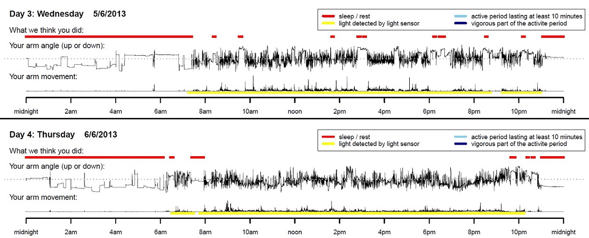

```{r, echo=FALSE, out.width = "60%", out.extra='style="border: 0; padding:20px"', fig.alt="GGIR logo"}
knitr::include_graphics("GGIR-MASTERLOGO-RGB.png")
```

```{r setup, include=FALSE}
knitr::opts_chunk$set(echo = TRUE)
```

**NOTE: With the growing amount of functionality in GGIR we have decided to migrate the narrative documentation to the [GitHub pages of GGIR](https://wadpac.github.io/GGIR/). This to ease maintenance and accessibility. Therefore, many of the sections in this vignette have been replaced by a link to their new location.**

# Introduction

## What is GGIR?

[GGIR](https://CRAN.R-project.org/package=GGIR) is an R-package to
process multi-day raw accelerometer data for physical activity and sleep
research. The term ***raw*** refers to data being expressed in
m/s<sup>2</sup> or gravitational acceleration as opposed to the previous
generation accelerometers which stored data in accelerometer brand
specific units. The signal processing includes automatic calibration,
detection of sustained abnormally high values, detection of non-wear and
calculation of average magnitude of dynamic acceleration based on a
variety of metrics. Next, GGIR uses this information to describe the
data per recording, per day of measurement, and (optionally) per segment
of a day of measurement, including estimates of physical activity,
inactivity and sleep. We published an overview paper of GGIR in 2019
[link](https://doi.org/10.1123/jmpb.2018-0063).

This vignette provides a general introduction on how to use GGIR and
interpret the output, additionally you can find a [introduction
video](https://youtu.be/RuFBCAqFJ2M) and a
[mini-tutorial](https://youtu.be/S8YPTrYNWdU) on YouTube. If you want to
use your own algorithms for raw data then GGIR facilitates this with
it's external function embedding feature, documented in a separate
vignette: [Embedding external functions in
GGIR](https://CRAN.R-project.org/package=GGIR). GGIR is increasingly
being used by research groups across the world. A non-exhaustive
overview of academic publications related to GGIR can be found
[here](https://github.com/wadpac/GGIR/wiki/Publication-list). R package
GGIR would not have been possible without the support of the
contributors listed in the author list at
[GGIR](https://CRAN.R-project.org/package=GGIR), with specific code
contributions over time since April 2016 (when GGIR development moved to
GitHub) shown
[here](https://github.com/wadpac/GGIR/graphs/contributors).

**Cite GGIR:**

When you use GGIR in publications do not forget to cite it properly as
that makes your research more reproducible and it gives credit to it's
developers. See paragraph on [Citing GGIR](#CitingGGIR) for details.

## Contributing, Support, and Keeping up to date

**How to contribute to the code?**

The development version of GGIR can be found on
[github](https://github.com/wadpac/GGIR), which is also where you will
find
[guidance](https://github.com/wadpac/GGIR/blob/master/CONTRIBUTING.md)
on how to contribute.

**How can I get service and support?**

GGIR is open source software and does not come with service or support
guarantees. However, as user-community you can help each other via the
[GGIR google
group](https://groups.google.com/forum/#!forum/RpackageGGIR) or the
[GitHub issue tracker](https://github.com/wadpac/GGIR/issues). Please
use these public platform rather than private e-mails such that other
users can learn from the conversations.

If you need dedicated support with the use of GGIR or need someone to
adapt GGIR to your needs then Vincent van Hees is available as
[independent consultant](https://www.accelting.com/).

**Training in R essentials and GGIR** We offer frequent online GGIR training courses. Check our dedicated training
[website](https://www.accelting.com/ggir-training/) with more details and
the option to book your training. Do you have questions about the
training or the booking process? Do not hesitate to contact us via:
[training\@accelting.com](mailto:training@accelting.com){.email}.

Also of interest may be the brief [free R introduction tutorial](https://www.accelting.com/short-r-tutorial/).


**Change log**

Our log of main changes to GGIR over time can be found
[here](https://cran.r-project.org/package=GGIR/news/news.html).

# Setting up your work environment

## Install R and RStudio

[Download and install R](https://cran.r-project.org/)

[Download and install
RStudio](https://posit.co/products/open-source/rstudio/)

Install GGIR with its dependencies from CRAN. You can do this with one
command from the console command line:

```{R,eval=FALSE}
install.packages("GGIR", dependencies = TRUE)
```

Alternatively, to install the latest development version with the latest
bug fixes use instead:

```{R,eval=FALSE}
install.packages("remotes")
remotes::install_github("wadpac/GGIR")
```

Additionally, in some use-cases you will need to install one or multiple 
additional packages:

-   If you are working with Axivity, GENEActiv, or GENEA files, install
    the GGIRread package with `install.packages("GGIRread")`
-   If you are working with ActiGraph gt3x files, install
    the read.gt3x package with `install.packages("read.gt3x")`
-   If you want to derive Neishabouricounts (with `do.neishabouricounts = TRUE`),
    install the actilifecounts package with `install.packages("actilifecounts")`
-   If you want to derive circadian rhythm indicators using the [Cosinor analysis and Extended Cosinor analysis] 
    (with `cosinor = TRUE` for part 2, in part 6 it is always performed), install the ActCR package with `install.packages("ActCR")`

## Prepare folder structure

1.  GGIR works with the following accelerometer brands and formats:
    -   [GENEActiv](https://activinsights.com/) .bin
    -   [Axivity](https://axivity.com/) AX3 and AX6 .cwa
    -   [ActiGraph](https://theactigraph.com) .csv and .gt3x (.gt3x
        only the newer format generated with firmware versions above
        2.5.0. Serial numbers that start with "NEO" or "MRA" and have
        firmware version of 2.5.0 or earlier use an older format of the
        .gt3x file). Note for Actigraph users: If you want to work with
        .csv exports via the commercial ActiLife software then note that
        you have the option to export data with timestamps. Please do
        not do this as this causes memory issues for GGIR. To cope with
        the absence of timestamps GGIR will calculate timestamps from
        the sample frequency, the start time and start date as presented
        in the file header.
    -   [Movisens](https://www.movisens.com/en/) .bin files with data 
        stored in folders. GGIR expects that each participant's folder 
        contains at least a file named acc.bin.
    -   Any other accelerometer brand that generates csv output, see
        documentation for functions `read.myacc.csv` and argument
        `rmc.noise` in the [GGIR function documentation
        (pdf)](https://CRAN.R-project.org/package=GGIR/GGIR.pdf).
    Note that functionality for the following file formats was part of GGIR but has
    been deprecated as it required a significant maintenance effort without 
    a clear use case or community support: (1) .bin for the Genea monitor by
    Unilever Discover, an accelerometer that was used for some studies between
    2007 and 2012) .bin, and (2) .wav files as can be exported by the 
    Axivity Ltd OMGUI software. Please contact us if you think
    these data formats should be facilitated by GGIR again and if you are interested
    in supporting their ongoing maintenance.

2.  All accelerometer data that needs to be analysed should be stored in
    one folder, or subfolders of that folder.
3.  Give the folder an appropriate name, preferable with a reference to
    the study or project it is related to rather than just 'data',
    because the name of this folder will be used later on as an
    identifier of the dataset.

## GGIR shell function

This section has been migrated to this [section](https://wadpac.github.io/GGIR/articles/chapter2_Pipeline.html#the-ggir-function) in the GGIR github-pages, which is now the main documentation resource for GGIR.

### Key general arguments

You will probably never need to think about most of the arguments listed
above, because a lot of arguments are only included to facilitate
methodological studies where researchers want to have control over every
little detail. See previous paragraph for links to the documentation and
how to find the default value of each parameter.

The bare minimum input needed for `GGIR` is:

```{R,eval=FALSE}
library(GGIR)
GGIR(datadir="C:/mystudy/mydata",
 outputdir="D:/myresults")
```

Argument `datadir` allows you to specify where you have stored your
accelerometer data and `outputdir` allows you to specify where you would
like the output of the analyses to be stored. This cannot be equal to
`datadir`. If you copy paste the above code to a new R script (file
ending with .R) and Source it in R(Studio) then the dataset will be
processed and the output will be stored in the specified output
directory.

Below we have highlighted the key arguments you may want to be aware of.
We are not giving a detailed explanation, please see the package manual
for that.

-   `mode` - which part of GGIR to run, GGIR is constructed in five
    parts with a sixth part under development.
-   `overwrite` - whether to overwrite previously produced milestone
    output. Between each GGIR part, GGIR stores milestone output to ease
    re-running parts of the pipeline.
-   `idloc` - tells GGIR where to find the participant ID (default:
    inside file header)
-   `data_masking_strategy` - informs GGIR how to consider the design of the
    experiment.
    -   If `data_masking_strategy` is set to value 1, then check out arguments
        `hrs.del.start` and `hrs.del.end`.
    -   If `data_masking_strategy` is set to value 3 or 5, then check out arguments
        `ndayswindow`, `hrs.del.start` and `hrs.del.end`.
-   `maxdur` - maximum number of days you expect in a data file based on
    the study protocol.
-   `desiredtz` - time zone of the experiment.
-   `chunksize` - a way to tell GGIR to use less memory, which can be
    useful on machines with limited memory.
-   `includedaycrit` - tell GGIR how many hours of valid data per day
    (midnight-midnight) is acceptable.
-   `includenightcrit` - tell GGIR how many hours of a valid night
    (noon-noon) is acceptable.
-   `qwindow` - argument to tell GGIR whether and how to segment the day
    for day-segment specific analysis.
-   `mvpathreshold` and `boutcriter` - acceleration threshold and bout
    criteria used for calculating time spent in MVPA (only used in GGIR
    part2).
-   `epochvalues2csv` - to export epoch level magnitude of acceleration
    to a csv files (in addition to already being stored as RData file)
-   `dayborder` - to decide whether the edge of a day should be other
    than midnight.
-   `iglevels` - argument related to intensity gradient method proposed
    by A. Rowlands.
-   `do.report` - specify reports that need to be generated.
-   `viewingwindow` and `visualreport` - to create a visual report, this
    only works when all five parts of GGIR have successfully run.
    Note that the visual report was initially developed to provide something to show to
    study participants and not for data quality checking purposes. Over time we have improved
    the visual report to also be useful for QC-ing the data. however, some of
    the scorings as shown in the visual report are created for the visual report only and
    may not reflect the scorings in the main GGIR analyses as reported in the
    quantitative csv-reports. Most of our effort in the past 10 years has gone 
    into making sure that the csv-report are correct, while the visualreport has
    mostly been a side project. This is unfortunate and we hope to find funding
    in the future to design a new report specifically for the purpose of
    QC-ing the anlayses done by GGIR.
-   `maxRecordingInterval` - if specified controls whether neighboring or
    overlapping recordings with the same participant ID and brand are appended
    at epoch level. This can be useful when the intention is to monitor behaviour
    over larger periods of time but accelerometers only allow for a few weeks of 
    data collection. GGIR will never append or alter the raw input file, this operation
    is preformed on the derived data.
-   `study_dates_file` - if specified trims the recorded data to the first and 
    last date in which the study took place. This is relevant for studies that started
    the recording several days before the accelerometers were actually worn by
    participants. This is used on the top of data_masking_strategy, so that it may be combined
    with the strategies in GGIR.

### Key arguments related to sleep analysis {#key-arguments-related-to-sleep-analysis}

For an explanation on how sleep is detected and the specific role of the
various function arguments see section [Sleep
analysis](#Sleep_analysis).

-   Arguments related to configuring the sleep detection algorithm:
    `anglethreshold`, `timethreshold`, `HASPT.algo`, `HASIB.algo`,
    `Sadeh_axis`, and `HASPT.ignore.invalid`.
-   `ignorenonwear` if set to TRUE then ignore detected monitor non-wear
    periods in the detection of sustained inactivity bouts to avoid
    confusion between monitor non-wear time.
-   If you want to create a visualisation of how sleep period time and
    sustained inactivity bouts match throughout a day then consider
    arguments `do.visual`, `outliers.only`, and `criterror`.
-   If you want to exclude the first and last night from the sleep
    analysis then used `excludefirstlast`.
-   `def.noc.sleep` specifies how the sleep period time window should be
    estimated if no sleeplog is used.
-   `includenightcrit` Minimum number of valid hours per night (24 hour
    window between noon and noon or 6pm-6pm).
-   `data_cleaning_file` to ginore specific nights for specific
    individuals, see also section [Data cleaning
    file](#Data_cleaning_file).
-   If you want the sleep analysis to be guided by a sleeplog (diary)
    then check out arguments `loglocation` which specifies the location
    of the spreadsheet (csv) with sleep log information. Further, use
    arguments `colid` and `coln1` to specify
    the details of your sleep log structure.

GGIR facilitates two possible sleeplog file structures:

#### Basic sleep log

This section has been migrated to this [section](https://wadpac.github.io/GGIR/articles/chapter9_SleepFundamentalsGuiders.html#basic-sleep-log) in the GGIR github-pages, which is now the main documentation resource for GGIR.

#### Advanced sleep log

This section has been migrated to this [section](https://wadpac.github.io/GGIR/articles/chapter9_SleepFundamentalsGuiders.html#advanced-sleep-log) in the GGIR github-pages, which is now the main documentation resource for GGIR.

### Key arguments related to time use analysis

For an explanation on how time use analysis is performed see section
[Waking-waking or 24 hour time-use analysis](#Waking-waking_or_24_hour).

-   `excludefirstlast.part5` - whether to ignore the last and first day.
-   `includedaycrit.part5` - tell GGIR what fraction of the waking hours
    in a day (value below 1) is acceptable.
-   `minimum_MM_length.part5` - tell GGIR what the minimum length
    (hours) should be of the MM window in part 5.
-   Configure thresholds for acceleration levels (some may want to
    interpret this as intensity levels): `threshold.lig`,
    `threshold.mod`, `threshold.vig`.
-   Configure what fraction of a bout needs to meet the threshold
    (cut-point) crtieria `boutcriter.in`, `boutcriter.lig`,
    `boutcriter.mvpa`. Note that boutcriter.mvpa = 0.8 means that an
    MVPA bout can have interruptions
    (i.e., the time out of MVPA intensity) that meet the following
    criteria:
    (1) A single interruption can last \< 1 min
    (2) Repeated interruptions are allowed provided that their total
        time does not exceed 20% of the bout duration
    (3) The time spent in the interruptions is included in the duration
        of the MVPA bout. For example: A 25-minute bout can have two 1
        minute interruption, but not a single 2-minute interruption.
        Here, the full 25 minutes would count towards the duration of
        the MVPA bout.
-   `timewindow` to specify whether days should be defined from midnight
    to midnight `"MM"`, from waking-up to waking-up `"WW"`, from sleep onset
    to sleep onset `"OO"`, or any combination of them.
-   Configure durations of bouts: `boutdur.mvpa`, `boutdur.in`, and
    `boutdur.lig`. Note that this can be a vector of multiple values
    indicating the minimum and maximum duration of subsequent bout
    types, e.g. 1-5 minutes MVPA, 5-10 minutes MVPA, and longer than 10
    minutes MVPA.

### Published cut-points and how to use them

This section has been rewritten and moved. Please, visit the vignette
[Published cut-points and how to use them in GGIR](https://cran.r-project.org/package=GGIR)
for more details on the cut-points available, how to use them, and some
additional reflections on the use of cut-points in GGIR.

### Example call

If you consider all the arguments above you me may end up with a call to
`GGIR` that could look as follows.

```{R,eval=FALSE}
library(GGIR)
GGIR(mode=c(1,2,3,4,5),
      datadir="C:/mystudy/mydata",
      outputdir="D:/myresults",
      do.report=c(2,4,5),
      #=====================
      # Part 2
      #=====================
      data_masking_strategy = 1,
      hrs.del.start = 0,          hrs.del.end = 0,
      maxdur = 9,                 includedaycrit = 16,
      qwindow=c(0,24),
      mvpathreshold =c(100),
      excludefirstlast = FALSE,
      includenightcrit = 16,
      #=====================
      # Part 3 + 4
      #=====================
      def.noc.sleep = 1,
      outliers.only = TRUE,
      criterror = 4,
      do.visual = TRUE,
      #=====================
      # Part 5
      #=====================
      threshold.lig = c(30), threshold.mod = c(100),  threshold.vig = c(400),
      boutcriter = 0.8,      boutcriter.in = 0.9,     boutcriter.lig = 0.8,
      boutcriter.mvpa = 0.8, boutdur.in = c(1,10,30), boutdur.lig = c(1,10),
      boutdur.mvpa = c(1),
      includedaycrit.part5 = 2/3,
      #=====================
      # Visual report
      #=====================
      timewindow = c("WW"),
      visualreport=TRUE)
```

Once you have used `GGIR` and the output directory (outputdir) will be
filled with milestone data and results.

### Configuration file

This section has been migrated to this [section](https://wadpac.github.io/GGIR/articles/chapter2_Pipeline.html#configuration-file-) in the GGIR github-pages, which is now the main documentation resource for GGIR.

# Time for action: How to run your analysis?

## From the R console on your own desktop/laptop

Create an R-script and put the GGIR call in it. Next, you can source the R-script
with the `source` function in R:

`source("pathtoscript/myshellscript.R")`

or use the Source button in RStudio if you use RStudio.

## In a cluster

This section has been migrated to this [section](https://wadpac.github.io/GGIR/articles/chapter2_Pipeline.html#in-a-cluster) in the GGIR github-pages, which is now the main documentation resource for GGIR.

## Processing time

This section has been migrated to this [section](https://wadpac.github.io/GGIR/articles/chapter2_Pipeline.html#processing-time) in the GGIR github-pages, which is now the main documentation resource for GGIR.

# Inspecting the results

GGIR generates the following types of output. - csv-spreadsheets with
all the variables you need for physical activity, sleep and circadian
rhythm research - Pdfs with on each page a low resolution plot of the
data per file and quality indicators - R objects with milestone data -
Pdfs with a visual summary of the physical activity and sleep patterns
as identified (see example below)

```{r, out.width = "700px",echo=FALSE, fig.alt="Example visualreport"}

```

## Output part 2 {.tabset}

This section has been migrated to this [section](https://wadpac.github.io/GGIR/articles/GGIRoutput.html) in the GGIR github-pages, which is now the main documentation resource for GGIR.

### Person level summary

This section has been migrated to this [section](https://wadpac.github.io/GGIR/articles/GGIRoutput.html) in the GGIR github-pages, which is now the main documentation resource for GGIR.

### Day level summary

This section has been migrated to this [section](https://wadpac.github.io/GGIR/articles/GGIRoutput.html) in the GGIR github-pages, which is now the main documentation resource for GGIR.

### Data_quality_report

This section has been migrated to this [section](https://wadpac.github.io/GGIR/articles/GGIRoutput.html) in the GGIR github-pages, which is now the main documentation resource for GGIR.

## Output part 4 {.tabset}

This section has been migrated to this [section](https://wadpac.github.io/GGIR/articles/GGIRoutput.html) in the GGIR github-pages, which is now the main documentation resource for GGIR.

### Night level summaries

This section has been migrated to this [section](https://wadpac.github.io/GGIR/articles/GGIRoutput.html) in the GGIR github-pages, which is now the main documentation resource for GGIR.

#### Non-default variables in part 4 csv report

This section has been migrated to this [section](https://wadpac.github.io/GGIR/articles/GGIRoutput.html) in the GGIR github-pages, which is now the main documentation resource for GGIR.

### visualisation_sleep.pdf

This section has been migrated to this [section](https://wadpac.github.io/GGIR/articles/GGIRoutput.html) in the GGIR github-pages, which is now the main documentation resource for GGIR.

## Output part 5 {.tabset}

This section has been migrated to this [section](https://wadpac.github.io/GGIR/articles/GGIRoutput.html) in the GGIR github-pages, which is now the main documentation resource for GGIR.

### Day level summary {#output5}

This section has been migrated to this [section](https://wadpac.github.io/GGIR/articles/GGIRoutput.html) in the GGIR github-pages, which is now the main documentation resource for GGIR.

### Person level summary

This section has been migrated to this [section](https://wadpac.github.io/GGIR/articles/GGIRoutput.html) in the GGIR github-pages, which is now the main documentation resource for GGIR.


## Output part 6 {.tabset}

When `part6CR = TRUE` and the vector as specified for paramter `do.report` includes the number 6, a csv report will be stored with the following variables:


| Variable name               | Description                                  |
|-----------------------------|----------------------------------------------|
| ID                          | Participant ID extracted from file           |
| starttime                   | Start timestamp for the data as used for the analysis    |
| filename	                  | File name                 |
| N_days	                    | Number of days in the data as used for the analysis |
| N_valid_days                | Number of valid days in the data as used for the analysis, defined as the cumulative number of epoch expressed in days |
| `cosinor_`         | Cosinor analysis estimates such as mes, amp, acrophase, and acrotime, as documented in the [Ac tCR](https://CRAN.R-project.org/package=ActCR) package.   |
| `cosinorExt_`      | Extended Cosinor analysis estimates such as minimum, amp, alpha, beta, acrotime, UpMesor, DownMesor, MESOR, and F_pseudo, as documented in the [Ac tCR](https://CRAN.R-project.org/package=ActCR) package.|
| `IV`  | Intradaily Variability (IV) after Eus J. W. Van Someren (Chronobiology International. 1999. Volume 16, issue 4). Implementation described in Ian Meneghel Danilevicz et al. https://doi.org/10.21203/rs.3.rs-3543711/v1      |
| `IS`  | Interdaily Stability (IS) after Eus J. W. Van Someren (Chronobiology International. 1999. Volume 16, issue 4). Implementation described in Ian Meneghel Danilevicz et al. https://doi.org/10.21203/rs.3.rs-3543711/v1 |
| phi     | Ian Meneghel Danilevicz  et al. https://doi.org/10.21203/rs.3.rs-3543711/v1    |
| SSP     | Only created when `part6DFA = TRUE`. Self-Similarity parameter as part of the Detrended Fluctuation Analysis. Implementation described in Ian Meneghel Danilevicz et al. https://doi.org/10.21203/rs.3.rs-3543711/v1.    |
| ABI     | Only created when `part6DFA = TRUE`. Activity Balance Index. Implementation described in Ian Meneghel Danilevicz et al. https://doi.org/10.21203/rs.3.rs-3543711/v1.|


# Motivation and clarification

In this chapter we will try to collect motivations and clarification
behind GGIR which may not have been clear from the existing
publications.

## Reproducibilty of GGIR analyses

Some tips to increase reproducibility of your findings:

1.  When you publish your findings, please remember to add the GGIR
    package version number. All of GGIR are archived by CRAN and
    available from the archive section on the package
    [website](https://CRAN.R-project.org/package=GGIR). GGIR has evolved
    over the years. To get a better understanding of how versions differ
    you should check the NEWS sections from the package
    [website](https://CRAN.R-project.org/package=GGIR)
2.  Report how you configured the accelerometer
3.  Report the study protocol and wear instructions given to the
    participants
4.  Report GGIR version
5.  Report how GGIR was used: Share the config.csv file or your R script
6.  Report how you post-processed / cleaned GGIR output
7.  Report how reported outcomes relate to the specific variable names
    in GGIR

## Auto-calibration

This section has been migrated to this [section](https://wadpac.github.io/GGIR/articles/chapter3_QualityAssessment.html#auto-calibration-algorithm) in the GGIR github-pages, which is now the main documentation resource for GGIR.

## Non-wear detection

This section has been migrated to this [section](https://wadpac.github.io/GGIR/articles/chapter3_QualityAssessment.html#non-wear-detection)  in the GGIR github-pages, which is now the main documentation resource for GGIR.

## Clipping score

This section has been migrated to this [section](https://wadpac.github.io/GGIR/articles/chapter3_QualityAssessment.html#clipping-detection)  in the GGIR github-pages, which is now the main documentation resource for GGIR.

## Why collapse information to epoch level?

Although many data points are collected we decide to only work with
aggregated values (e.g. 1 or 5 second epochs) for the following reasons:

1.  Accelerometers are often used to describe patterns in metabolic
    energy expenditure. Metabolic energy expenditure is typically
    defined per breath or per minute (indirect calorimetry), per day
    (room calorimeter), or per multiple days (doubly labelled water
    method). In order to validate our methods against these reference
    standards we need to work with a similar time resolution.

2.  Collapsing the data to epoch summary measures helps to standardise
    for differences in sample frequency between studies.

3.  There is little evidence that the raw data is an accurate
    representation of body acceleration. All scientific evidence on the
    validity of accelerometer data has so far been based on epoch
    averages.

4.  Collapsing the data to epoch summary measures may help to average
    out different noise levels and make sensor brands more comparable.

### Why does the first epoch not allign with the original start of the recording

GGIR uses short (default 5 seconds) and long epochs (default 15
minutes). The epochs are aligned to the hour in the day, and to each
other. For example, if a recording starts at 9:52:00 then the GGIR will
work with epochs derived from 10:00:00 onward. If the recording starts
at 10:12 then GGIR will work with epochs derived from 10:15:00 onward.

Motivation:

-   This allows us to have a standardised time grid across recordings to
    describe behaviour.
-   This allows us to calculate behaviour exactly per day or per
    specified time interval in a day.

If the first 15 minute epochs would start at 9:52 then the next one
would start at 10:07, which makes it impossible to make statement about
behaviour between 10:00 and 13:00.

## Sleep analysis {#Sleep_analysis}

This section has been migrated to this [section](https://wadpac.github.io/GGIR/articles/chapter8_SleepFundamentalsSibs.html) in the GGIR github-pages, which is now the main documentation resource for GGIR.

### Notes on sleep classification algorithms designed for count data


#### Replication of the movement counts needed

This section has been migrated to this [section](https://wadpac.github.io/GGIR/articles/chapter4_AccMetrics.html#notes-on-implementation-of-zero-crossing-counts) in the GGIR github-pages, which is now the main documentation resource for GGIR.


#### Missing information for replicating movement counts

This section has been migrated to this [section](https://wadpac.github.io/GGIR/articles/chapter4_AccMetrics.html#notes-on-implementation-of-zero-crossing-counts) in the GGIR github-pages, which is now the main documentation resource for GGIR.

#### An educated guess and how you can to help optimise the implementation

This section has been migrated to this [section](https://wadpac.github.io/GGIR/articles/chapter4_AccMetrics.html#notes-on-implementation-of-zero-crossing-counts) in the GGIR github-pages, which is now the main documentation resource for GGIR.

### Guiders

This section has been migrated to this [section](https://wadpac.github.io/GGIR/articles/chapter9_SleepFundamentalsGuiders.html) in the GGIR github-pages, which is now the main documentation resource for GGIR.

### Daysleepers (nights workers)

This section has been migrated to this [section](https://wadpac.github.io/GGIR/articles/chapter9_SleepFundamentalsGuiders.html#time-window-used-for-sleep-analyses) in the GGIR github-pages, which is now the main documentation resource for GGIR.

### Cleaningcode {#Cleaningcode}

This section has been migrated to this [section](https://wadpac.github.io/GGIR/articles/chapter10_SleepAnalysis.html#cleaningcode) in the GGIR github-pages, which is now the main documentation resource for GGIR.

### Difference between cleaned and full output

This section has been migrated to this [section](https://wadpac.github.io/GGIR/articles/chapter10_SleepAnalysis.html#related-output) in the GGIR github-pages, which is now the main documentation resource for GGIR.

### Data cleaning file {#Data_cleaning_file}

This section has been migrated to this [section](https://wadpac.github.io/GGIR/articles/chapter10_SleepAnalysis.html#data-cleaning-file) in the GGIR github-pages, which is now the main documentation resource for GGIR.

## Waking-waking or 24 hour time-use analysis {#Waking-waking_or_24_hour}

This section has been migrated to this [section](https://wadpac.github.io/GGIR/articles/chapter12_TimeUseAnalysis.html) in the GGIR github-pages, which is now the main documentation resource for GGIR.

### Time series output files

This section has been migrated to this [section](https://wadpac.github.io/GGIR/articles/chapter12_TimeUseAnalysis.html#exporting-time-series) in the GGIR github-pages, which is now the main documentation resource for GGIR.

### Day inclusion criteria

The full part 5 output is stored in the `results/QC` folder. The default
inclusion criteria for days in the cleaned output from part 5 (stored in
the `results` folder) are:

-   For both MM and WW defined days: The valid (sensor worn) time
    fraction of the day needs to be above the fraction specified with
    argument `includedaycrit.part5` (default 2/3).
-   For MM defined days only: The length of the day needs to be at least
    the number of hours as specified by `minimum_MM_length.part5`
    (default 23). Note that if your experiment started and ended in the
    middle of the day then this default setting will exclude those
    incomplete first and last days. If you think including these days is
    still meaningful for your work then adjust the argument
    `minimum_MM_length.part5`.

**Important notes:**

-   No criteria is set for the amount of valid data during the SPT
    window, because all we are interested in part 5 is knowing the
    borders of the night and we trust that this was sufficiently
    estimated by part 4. If you disagree then please notice that all the
    days are included in the full report available in `results/QC`
    folder.
-   This means that argument `includenightcrit` as used for part 4 is
    not used in part 5.

The `data_cleaning_file` argument discussed in
[Data_cleaning_file](#Data_cleaning_file) also allows you to tell GGIR
which person(s) and day(s) should be omitted in part 5. The the day
numbers to be excluded should be listed in a column `day_part5` as
header.

### Fragmentation metrics

This section has been migrated to this [section](https://wadpac.github.io/GGIR/articles/chapter11_DescribingDataCutPoints.html#behavioural-fragmentation) in the GGIR github-pages, which is now the main documentation resource for GGIR.

**Difference between fragments and blocks:**

Elsewhere in the part5 we use the term `block`. A `block` is a sequence
of epochs that belong to the same behavioural class. This may sound
similar to the definition of a fragment, but for blocks we distinguish
every behavioural class, which includes the subcategories such as bouted
and unbouted behaviour. This means that variables `Nblock_day_total_IN`
and `Nblock_day_total_LIG` are identical to `Nfrag_IN_day` and
`Nfrag_LIPA_day`, respectively. In contrast, for fragments we may group LIPA and MVPA
together when refering to the fragmentation of PA.

**Differences with R package ActFrag:**

This section has been migrated to this [section](https://wadpac.github.io/GGIR/articles/chapter11_DescribingDataCutPoints.html#differences-with-r-package-actfrag) in the GGIR github-pages, which is now the main documentation resource for GGIR.


## Why use data metric ENMO as default?

This section has been migrated to this [section](https://wadpac.github.io/GGIR/articles/chapter4_AccMetrics.html#why-ggir-uses-enmo-as-a-default-) in the GGIR github-pages, which is now the main documentation resource for GGIR.


## What does GGIR stand for?

I wanted a short name and not to spend too much time finding it. The abbreviation has lost its functional meaning, which is why we now only use GGIR as the name.

## Circadian Rhythm analyses

This section has been migrated to this [section](https://wadpac.github.io/GGIR/articles/chapter13_CircadianRhythm.html) in the GGIR github-pages, which is now the main documentation resource for GGIR.

## ActiGraph's idle sleep mode

The idle sleep mode is [explained](https://actigraphcorp.my.site.com/support/s/article/Idle-Sleep-Mode-Explained)
on the manufacturer's website. In short, idle sleep mode is a setting that can
be turned on or off by the user. When it is turned on the device
will fall asleep during periods of no movement, resulting in time gaps in the data.
This functionality was probably introduced to safe battery life and minimize data size.
However, it also means that we end up with time gaps that need to be accounted for.

### Time gap imputation

This section has been migrated to this [section](https://wadpac.github.io/GGIR/articles/chapter3_QualityAssessment.html#time-gaps-in-actigraph-gt3x-and-ad-hoc-csv-files
) in the GGIR github-pages, which is now the main documentation resource for GGIR.

### The importance of reporting idle.sleep.mode usage

This section has been migrated to this [section](https://wadpac.github.io/GGIR/articles/chapter3_QualityAssessment.html#time-gaps-in-actigraph-gt3x-and-ad-hoc-csv-files
) in the GGIR github-pages, which is now the main documentation resource for GGIR.

## MX metrics (minimum intensity of most active X minutes)


This section has been migrated to this [section](https://wadpac.github.io/GGIR/articles/chapter7_DescribingDataWithoutKnowingSleep.html#sets-of-quantiles-mx-metrics-by-rowlands-et-al-) in the GGIR github-pages, which is now the main documentation resource for GGIR.

## Minimum recording duration {#Minimum_recording_duration}

GGIR has been designed to process multi-day recordings. The minimum recording duration
considered by GGIR depends on the type of analysis:

**Running part 1 and 2**

- File size; At least 2MB, where 2MB can be adjusted with argument minimumFileSizeMB. 
This should not be changed unless you have good reason to believe that a smaller 
file size is also acceptable.

- Recording duration: At least two long epoch windows 
(default 60 minutes) in g.readaccfile. The size of this epoch can be altered with
the second and third value of vector argument `windowsizes`, where the third should not
be smaller than the second. For example, in short lasting lab-experiments you may
find it easier to set this to `windowsizes = c(5, 600, 600)` as non-wear detection is
usually not necessary in lab studies.

**Running part 3 and 4**

- At least one night of data is expected, where a night is expected to have at least the timestamp 
for midnight. If midnight is not found the sleep detection is skipped.

**Running part 5**

- Ideally two valid consecutive nights and the waking hours in between.


## LUX sensor data processing

Although GGIR focuses on accelerometer data a few brands come with LUX data.

In part 1 GGIR calculates the peak lux per long epoch at a default resolution of 15 minutes,
which can be modified with argument windowsizes. Peak light offers a more reliable 
estimate of light exposure per time window compared with taking the average. Further,
LUX is used in the auto-calibration.

In GGIR part 2 we visualise the LUX values in the qc plot. In part 3 and 4 LUX is 
not used for sleep classification because relation between light exposure and sleep is weak.

In part 5 we calculate the mean and maximum of the peak LUX per epoch across all
waking hours of the day. Here, the mean (peak per epoch) LUX would then indicate
average light exposure per time segment, while max peak would indicate the maximum
light exposure per day. Further, we calculate the max and mean peak LUX per most 
active consecutive X hour of the day. This is intended to offer an alternative to LUX
exposure during waking hours which relies on correct sleep classification. LUX
exposure during M10 may be seen as an alternative if you are unsure whether you 
can trust the sleep classification in your data set.

# Other Resources

-   The [GGIR package manual](https://CRAN.R-project.org/package=GGIR)
    provides documentation on individual functions.
-   For general questions about how to use GGIR join our [google
    group/mailing
    list](https://groups.google.com/forum/#!forum/rpackageggir).
-   For bug reports please post them
    [here](https://github.com/wadpac/GGIR/issues).

# Citing GGIR {#CitingGGIR}

A correct citation of research software is important to make your
research reproducible and to acknowledge the effort that goes into the
development of open-source software.

To do so, please report the GGIR version you used in the text.
Additionally, please also cite:

1.  Migueles JH, Rowlands AV, et al. GGIR: A Research Community--Driven
    Open Source R Package for Generating Physical Activity and Sleep
    Outcomes From Multi-Day Raw Accelerometer Data. Journal for the
    Measurement of Physical Behaviour. 2(3) 2019. doi:
    10.1123/jmpb.2018-0063.

If your work depends on the quantification of **physical activity** then
also cite:

2.  van Hees VT, Gorzelniak L, et al. Separating Movement and Gravity
    Components in an Acceleration Signal and Implications for the
    Assessment of Human Daily Physical Activity. PLoS ONE 8(4) 2013.
    [link](https://journals.plos.org/plosone/article?id=10.1371/journal.pone.0061691)
3.  Sabia S, van Hees VT, Shipley MJ, Trenell MI, Hagger-Johnson G,
    Elbaz A, Kivimaki M, Singh-Manoux A. Association between
    questionnaire- and accelerometer-assessed physical activity: the
    role of sociodemographic factors. Am J Epidemiol. 2014 Mar
    15;179(6):781-90. doi: 10.1093/aje/kwt330. Epub 2014 Feb 4. PMID:
    24500862 [link](https://pubmed.ncbi.nlm.nih.gov/24500862/)

If you used the **auto-calibration functionality** then also cite:

4.  van Hees VT, Fang Z, et al. Auto-calibration of accelerometer data
    for free-living physical activity assessment using local gravity and
    temperature: an evaluation on four continents. J Appl Physiol 2014.
    [link](https://doi.org/10.1152/japplphysiol.00421.2014)

If you used the **sleep detection** then also cite:

5.  van Hees VT, Sabia S, et al. A novel, open access method to assess
    sleep duration using a wrist-worn accelerometer, PLoS ONE, 2015
    [link](https://journals.plos.org/plosone/article?id=10.1371/journal.pone.0142533)

If you used the **sleep detection without relying on sleep diary** then
also cite:

6.  van Hees VT, Sabia S, et al. Estimating sleep parameters using an
    accelerometer without sleep diary. Scientific Reports 2018. doi:
    10.1038/s41598-018-31266-z.
    [link](https://www.nature.com/articles/s41598-018-31266-z)

If you used the **sleep regularity index** then also cite:

7.  Andrew J. K. Phillips, William M. Clerx, et al. Irregular sleep/wake
    patterns are associated with poorer academic performance and delayed
    circadian and sleep/wake timing. Scientific Reports. 2017 June 12
    [link](https://www.nature.com/articles/s41598-017-03171-4).

## Copyright for GGIR logo

The copyright of the GGIR logo lies with Accelting (Almere, The
Netherlands), please contact
[v.vanhees\@acceleting.com](mailto:v.vanhees@acceleting.com){.email} to
ask for permission to use this logo.

```{r, echo=FALSE, out.width = "60%", out.extra='style="border: 0; padding:20px"', fig.alt="GGIR logo"}
knitr::include_graphics("GGIR-MASTERLOGO-RGB.png")
```
