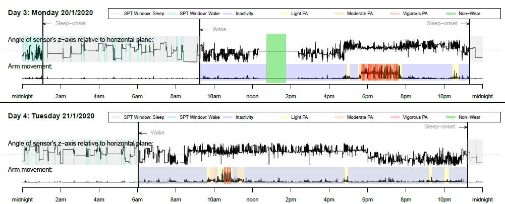

```{r setup, include=FALSE}
knitr::opts_chunk$set(echo = TRUE)
```

# Introduction

## What is GGIR?

[GGIR](https://CRAN.R-project.org/package=GGIR) is an R-package to process multi-day raw accelerometer data for physical activity and sleep research. The term _**raw**_ refers to data being expressed in m/s<sup>2</sup> or gravitational acceleration as opposed to the previous generation accelerometers which stored data in accelerometer brand specific units. The signal processing includes automatic calibration, detection of sustained abnormally high values, detection of non-wear and calculation of average magnitude of dynamic acceleration based on a variety of metrics. Next, GGIR uses this information to describe the data per recording, per day of measurement, and (optionally) per segment of a day of measurement, including estimates of physical activity, inactivity and sleep. 
We published an overview paper of GGIR in 2019 [link](https://doi.org/10.1123/jmpb.2018-0063).

This vignette provides a general introduction on how to use GGIR and interpret the output, additionally you can find a [introduction video](https://youtu.be/RuFBCAqFJ2M) and a [mini-tutorial](https://youtu.be/S8YPTrYNWdU) on YouTube. If you want to use your own algorithms for raw data then GGIR facilitates this with it's external function embedding feature, documented in a separate vignette: [Embedding external functions in GGIR](https://CRAN.R-project.org/package=GGIR). GGIR is increasingly being used by research groups acros the world. A non-exhaustive overview of academic publications related to GGIR can be found [here](https://github.com/wadpac/GGIR/wiki/Publication-list). R package GGIR would not have been possible without the support of the contributors listed in the author list at [GGIR](https://CRAN.R-project.org/package=GGIR).

**Cite GGIR:**

When you use GGIR in publications do not forget to cite it properly to make your analysis reproducible for others and to give credit to it's developers. See paragraph on [citing GGIR](#Citing GGIR) for details.


## Contributing, Support, and Keeping up to date

**How to contribute to code?**

The development version of GGIR can be found on [github](https://github.com/wadpac/GGIR), which is also where you will find guidance on how to contribute to the package development.  Open source software may be for free, but the time investment to develop it is never for free. Therefore, we welcome contributions to GGIR in time investment, constructive feedback, financially, or otherwise.


**How can I get service and support?**

If anything is not clear in the documentation, please let us know via either the [GGIR google group](https://groups.google.com/forum/#!forum/RpackageGGIR) or the [GitHub issue tracker](https://github.com/wadpac/GGIR/issues).

GGIR is open source software and does not come with service or support guarantees. However, as user-community you can help each other via the [GGIR google group](https://groups.google.com/forum/#!forum/RpackageGGIR) or the [GitHub issue tracker](https://github.com/wadpac/GGIR/issues). Please use these public platform rather than private e-mails such that others can learn from your conversations.

If you need dedicated support with the use of GGIR or need someone to adapt GGIR then Vincent van Hees is available as [indpendent consultant](https://www.movementdata.nl/).

**Change log**

Our log of main changes is [here](https://cran.r-project.org/package=GGIR/news.html).

# Setting up your work environment

## Install R and RStudio

[Download and install R](https://cran.r-project.org/)

[Download and install RStudio](https://www.rstudio.com/products/rstudio) (optional, but recommended)

Download GGIR with its dependencies, you can do this with one command from the console command line:

```{R,eval=FALSE}
install.packages("GGIR", dependencies = TRUE)
```

## Prepare folder structure

1. GGIR works with the following accelerometer brands and formats:
    - [GENEActiv](https://www.geneactiv.org/) .bin and .csv
    - [ActiGraph](http://actigraphcorp.com/) .csv. Note for Actigraph users:
In ActiLife you have the option to export data with timestamps. Please do not do this as this causes memory issues. To cope with the absense of timestamps GGIR will re-caculate timestamps from the sample frequency and the start time and date as presented in the file header.
    - [Axivity](http://axivity.com/) AX3 and AX6 .wav, .csv and .cwa
    - Genea (an accelerometer that is not available anymore, but which was used for some studies between 2007 and 2012) .bin and .csv
    - Any other accelerometer brand that generates csv output, see function documentation for function read.myacc.csv.
2. All accelerometer data that needs to be analysed should be stored in one folder, or subfolders of that folder.
3. Give the folder an appropriate name, preferable with a reference to the study or project it is related to rather than just 'data', because the name of this folder will be used later on as an identifier of the dataset.

## GGIR shell function

GGIR comes with a large number of functions and optional settings (arguments) per functions. To ease interacting with GGIR there is one central function, named `g.shell.GGIR`, to talk to all the other functions. Being confronted with the amount of optional arguments might feel like stepping inside the cockpit of an airplane:

`mode=c(1,2), f0=c(), f1=c(), selectdaysfile = c(), configfile=c(), overwrite = FALSE, strategy = 1, maxdur = 7, do.cal = TRUE,  hrs.del.start = 0, hrs.del.end = 0, loglocation = c(), , acc.metric = "ENMO", storefolderstructure = FALSE, windowsizes = c(5,900,3600), minloadcrit = 72, desiredtz = "Europe/London", chunksize = 1, do.enmo = TRUE, do.lfenmo = FALSE, do.en = FALSE,  do.bfen = FALSE, do.hfen = FALSE, do.hfenplus = FALSE, do.mad = FALSE, do.anglex = FALSE, do.angley = FALSE, do.anglez = FALSE, do.roll_med_acc_x=FALSE, do.roll_med_acc_y=FALSE, do.roll_med_acc_z=FALSE, do.dev_roll_med_acc_x=FALSE, do.dev_roll_med_acc_y=FALSE, do.dev_roll_med_acc_z=FALSE, do.enmoa = FALSE, dynrange = c(), printsummary = FALSE, includedaycrit = 16, M5L5res = 10, winhr = 5, qwindow = c(0,24), qlevels = c(), ilevels = c(), mvpathreshold = 100, boutcriter = 0.8, ndayswindow = 7, idloc = 1, do.imp = TRUE, anglethreshold = 5, timethreshold = 5, ignorenonwear = TRUE, colid=1, coln1=1, nnights=7, outliers.only=FALSE, excludefirstlast=FALSE, excludefirstlast.part5=FALSE, criterror=3, includenightcrit=16, relyonguider=FALSE, sleeplogidnum=TRUE, def.noc.sleep=c(), do.visual=FALSE, viewingwindow = 1, dofirstpage = TRUE, visualreport = FALSE, print.filename = FALSE, backup.cal.coef = c(), bout.metric = 1, closedbout = FALSE, IVIS_windowsize_minutes=60, IVIS_epochsize_seconds=30, constrain2range = TRUE, do.part3.pdf = TRUE, boutcriter.in = 0.9, boutcriter.lig = 0.8, boutcriter.mvpa = 0.8, threshold.lig = 40, threshold.mod = 100,   threshold.vig = 400, timewindow = c("MM","WW"), boutdur.mvpa = c(1,5,10), boutdur.in = c(10,20,30), boutdur.lig = c(1,5,10), save_ms5rawlevels = FALSE,  mvpadur = c(1,5,10), epochvalues2csv = FALSE, bout.metric = 1, window.summary.size = 10, dayborder = 0, iglevels = c()`

In this paragraph we will guide you through the main arguments relevant for 99% of research. First of all, it is important to understand that GGIR is structured in five parts and that `g.shell.GGIR` controls each of these parts:

- Part 1: Loads the data and stores derived features (aggregations) needed for the other parts. This is the time consuming part. Once this is done, parts 2-5 can be run (or re-run with different parameters in parts 2-5) relatively quickly.
- Part 2: Data quality analyses and low level description of signal features per day and per file. At this point a day is defined from midnight to midnight
- Part 3: Estimation of sustained inactivity and sleep periods, needed for input to Part 4 for sleep detection
- Part 4: o	Labels the sustained inactive periods detected in Part 3 as sleep, or daytime sustained inactivity, per night and per file
- Part 5: Derives sleep and physical activity characteristics by re-using information derived in part 2, 3 and 4. Total time in intensity categories, the number of bouts, time spent in bouts and average acceleration (overall activity) is calculated.

The reason why it split up in part is that it avoids having the re-do all analysis if you only want to make a small change in the more downstream parts.

By looking up the corresponding functions g.part1, g.part2, g.part3, g.part4, and g.part5 you can see what arguments are possible. All of these arguments are also accepted by `g.shell.GGIR`, because `g.shell.GGIR` is nothing more than a wrapper around those functions.

You will probably never need to think about most of the arguments listed above, because the default values are fine and a lot of arguments are only included to facilitate methodological studies where researchers want to have control over everything.

The bare minimum input needed for `g.shell.GGIR` is:

```{R,eval=FALSE}
library(GGIR)
g.shell.GGIR(datadir="C:/mystudy/mydata",
             outputdir="D:/myresults")
```

Argument `datadir` allows you to specify where you have stored your accelerometer data and `outputdir` allows you to specify where you would like the output of the analyses to be stored. This cannot be equal to `datadir`. If you copy paste the above code to a new R script (file ending with .R) and Source it in R(Studio) then the dataset will be processed and the output will be stored in the specified output directory.

Below we have highlighted the key arguments you may want to be aware of. We are not giving a detailed explanation, please see the package manual for that.

### Key general arguments

- `mode` - which part of GGIR to run, GGIR is constructed in five parts.
- `overwrite` - whether to overwrite previously produced milestone output. Between each GGIR part, GGIR stores milestone output to ease re-running parts of the pipeline.
- `idloc` - tells GGIR where to find the participant ID (default: inside file header)
- `strategy` - informs GGIR how to consider the design of the experiment.
  - If `strategy` is set to value 1, then check out arguments `hrs.del.start` and `hrs.del.end`.
  - If `strategy` is set to value 3, then check out arguments `ndayswindow`.
- `maxdur` - maximum number of days you expect in a data file based on the study protocol.
- `desiredtz` - time zone of the experiment.
- `chunksize` - a way to tell GGIR to use less memomry, which can be useful on machines with limited memory.
- `includedaycrit` - tell GGIR how many hours of valid data per day (midnight-midnight) is acceptable.
- `includenightcrit` - tell GGIR how many hours of a valid night (noon-noon) is acceptable.
- `qwindow` - argument to tell GGIR whether and how to segment the day for day-segment specific analysis.
- `mvpathreshold` and `boutcriter` - acceleration threshold and bout criteria used for calculating time spent in MVPA (only used in GGIR part2).
- `epochvalues2csv` - to export epoch level magnitude of acceleration to a csv files (in addition to already being stored as RData file)
- `dayborder` - to decide whether the edge of a day should be other than midnight.
- `iglevels` - argument related to intensity gradient method proposed by A. Rowlands.
- `do.report` - specify reports that need to be generated.
- `viewingwindow` and `visualreport` - to create a visual report, this only works when all five parts of GGIR have succesfully run.

### Key arguments related to sleep analysis

For an explanation on how sleep is detected see section [Sleep analysis](#Sleep analysis).

- If you want the sleep analysis to be guided by a sleeplog (diary) then use `loglocation`, `colid`, `coln1`, and `nnights` to configure this.
- `ignorenonwear`
- If you want to create a visualisation of how sleep period time and sustained inactivity bouts match throughout a day then consider `do.visual`, `outliers.only`, and `criterror`.
- If you want to exclude the first and last night from the sleep analysis then used `excludefirstlast`.
- `def.noc.sleep` specifies how the sleep period time window should be estimated if no sleeplog is used.
- `includenightcrit` Minimum number of valid hours per night (24 hour window between noon and noon or 6pm-6pm).

Some more detail about using a sleeplog: Argument 'loglocation' is the location of the spreadsheet (csv) with sleep log information. The spreadsheet needs to have the following structure: one column for participant id, and then followed by alternatingly one column for onset time and one column for waking
time (see example below). There can be multiple sleeplogs in the same spreadsheet. The first raw of the spreadsheet needs to be filled with column names, it does not matter what these column names are. Timestamps are to be stored without date as in hh:mm:ss. If onset corresponds to lights out or intention to fall asleep, then it is the end-users responsibility to account for this in the interpretation of the results.

```{r, out.width = "700px",echo=FALSE}
knitr::include_graphics("sleeplogexample.jpg")
```

### Key arguments related to time use analysis

For an explanation on how time use analysis is performed see section [Waking-waking or 24 hour time-use analysis](#Waking-waking or 24 hour time-use analysis).

- `excludefirstlast.part5` - whether to ignore the last and first day.
- `includedaycrit.part5` - tell GGIR what fraction of the waking hours in a day (value below 1) is acceptable.
- `minimum_MM_length.part5` - tell GGIR what the minimum length (hours) should be of the MM window in part 5.
- `bout.metric` - choose metric for calculating bouts (we recommend default setting 4).
- Configure thresholds for acceleration levels (some may want to interpret this as intensity levels): `threshold.lig`, `threshold.mod`, `threshold.vig`.
- Configure what fraction of a bout needs to meet the threshold (cut-point) crtieria `boutcriter.in`, `boutcriter.lig`, `boutcriter.mvpa`.
- `timewindow` to specify whether days should be defined from midnight to midnight `"MM"`, from waking-up to waking-up `"WW"`, or both `c("MM","WW")`.
- Configure durations of bouts: `boutdur.mvpa`, `boutdur.in`, and `boutdur.lig`. Note that this can be a vector of multiple values indicating the minimum and maximum duration of subsequent bout types, e.g. 1-5 minutes MVPA, 5-10 minutes MVPA, and longer than 10 minutes MVPA.

### Published cut-points and how to use them

Cut-points to estimate time spent in acceleration levels that are roughly liked to levels of energy metabolism have been proposed by:

- [Esliger et al 2011](https://journals.lww.com/acsm-msse/Fulltext/2011/06000/Validation_of_the_GENEA_Accelerometer.22.aspx): wrist and waist in adults.
- [Schaefer et al 2014](https://www.ncbi.nlm.nih.gov/pmc/articles/PMC3960318/): wrist in 6-11 year old children.
- [Roscoe et al 2017](https://link.springer.com/article/10.1007/s00431-017-2948-2): wrist in 4-5 year old pre-school children.
- [Phillips et al 2013](https://europepmc.org/article/med/22770768): wrist and hip in 8-14 year olds.
- [Vaha-Ypya et al 2015](https://journals.plos.org/plosone/article?id=10.1371/journal.pone.0134813): hip in adults.
- [Hildebrand et al 2014](https://journals.lww.com/acsm-msse/Fulltext/2014/09000/Age_Group_Comparability_of_Raw_Accelerometer.17.aspx) and [2016](https://onlinelibrary.wiley.com/doi/abs/10.1111/sms.12795): wrist and hip in 7-11 and 21-61 years old.
- If you are aware of any additional publications then let us know.

The first four publications make use of acceleration metrics that sum their values per epoch rather than average them per epoch like GGIR does. However, no need to worry: It is still possible to use those cut-points with a simple cut-point scaling trick and by selecting the right acceleration metric as detailed below.

**Esliger 2011, Phillips 2013:**

-	In GGIR use metric ENMOa instead of ENMO with arguments `do.enmoa = TRUE`, `do.enmo = FALSE`, and `acc.metric=”ENMOa”`.
- `threshold.lig = (LightCutPointFromPaper/80) * 1000`
- `threshold.mod = (ModerateCutPointFromPaper/80) * 1000`
- `threshold.vig = (VigorousCutPointFromPaper/80) * 1000`
- `mvpathreshold = (ModerateCutPointFromPaper/80) * 1000`
-	In the part2 results you will need the MVPA estimates that are related to ENMOa, not ENMO.
-	In the part 5 results everything will be based on the new cut-points.

**Roscoe 2017:**

-	In GGIR use metric ENMOa instead of ENMO with arguments `do.enmoa = TRUE`, `do.enmo = FALSE`, and `acc.metric=”ENMOa”`.
- `threshold.lig = (LightCutPointFromPaper/85.7) * 1000`
- `threshold.mod = (ModerateCutPointFromPaper/85.7) * 1000`
- `threshold.vig = (VigorousCutPointFromPaper/85.7) * 1000`
- `mvpathreshold = (ModerateCutPointFromPaper/85.7) * 1000`
-	In the part2 results you will need the MVPA estimates that are related to ENMOa, not ENMO.
-	In the part 5 results everything will be based on the new cut-points.

**Schaeffer 2014:**

-	In GGIR use metric EN instead of ENMO with arguments `do.en = TRUE`, `do.enmo = FALSE`, and `acc.metric=”EN”`.
-	Specify Schaeffer cut-points as:
- `threshold.lig = (LightCutPointFromPaper/75) * 1000`
- `threshold.mod = (ModerateCutPointFromPaper/75) * 1000`
- `threshold.vig = (VigorousCutPointFromPaper/75) * 1000`
- `mvpathreshold = (ModerateCutPointFromPaper/75) * 1000`-	In the part2 results you will need the MVPA estimates that are related to EN, not ENMO.
-	In the part 5 results everything will be based on the new cut-points.

**Vaha-Ypya et al 2015:**

-	Use default setting do.mad= TRUE, acc.metric=”MAD”
-	Use the cut-points as provided by Vaha-Ypya directly. No need for scaling.

**Hildebrand 2014 and Hildebrand 2016:**

-	Use default setting do.enmo= TRUE, acc.metric=”ENMO”
-	Use the cut-points as provided by Hildebrand directly. No need for scaling.


### Example call

So, if you consider all the arguments above you me may end up with a call to `g.shell.GGIR` that could look as follows.

```{R,eval=FALSE}
library(GGIR)
g.shell.GGIR(
             mode=c(1,2,3,4,5),
             datadir="C:/mystudy/mydata",
             outputdir="D:/myresults",
             do.report=c(2,4,5),
             #=====================
             # Part 2
             #=====================
             strategy = 1,
             hrs.del.start = 0,          hrs.del.end = 0,
             maxdur = 9,                 includedaycrit = 16,
             qwindow=c(0,24),
             mvpathreshold =c(100),
             bout.metric = 4,
             excludefirstlast = FALSE,
             includenightcrit = 16,
             #=====================
             # Part 3 + 4
             #=====================
             def.noc.sleep = 1,
             outliers.only = TRUE,
             criterror = 4,
             do.visual = TRUE,
             #=====================
             # Part 5
             #=====================
             threshold.lig = c(30), threshold.mod = c(100),  threshold.vig = c(400),
             boutcriter = 0.8,      boutcriter.in = 0.9,     boutcriter.lig = 0.8,
             boutcriter.mvpa = 0.8, boutdur.in = c(1,10,30), boutdur.lig = c(1,10),
             boutdur.mvpa = c(1),
             includedaycrit.part5 = 2/3,
             #=====================
             # Visual report
             #=====================
             timewindow = c("WW"),
             visualreport=TRUE)
```

Once you have used `g.shell.GGIR` and the output directory (outputdir) will be filled with milestone data and results.

### Configuration file

Function `g.shell.GGIR` stores all the explicitely entered argument values and default values for the argument that are not explicitely
provided in a csv-file named config.csv stored in the root of the output folder. The config.csv file is accepted as input to `g.shell.GGIR`
with argument `configfile` to replace the specification of all the arguments, except `datadir` and `outputdir`, see example below.

```{R,eval=FALSE}
library(GGIR)
g.shell.GGIR(datadir="C:/mystudy/mydata",
             outputdir="D:/myresults", configfile = "D:/myconfigfiles/config.csv")
```

The practical value of this is that it eases the replication of analysis, because instead of having to share you R script, sharing your config.csv file will be sufficient. Further, the config.csv file contribute to the reproducibility of your data analysis.

Note 1: When combining a configuration file with explicitely provided argument values, the explicitely provided argument values will overrule the argument values in the configuration file.
Note 2: The config.csv file in the root of the output folder will be overwritten every time you use `g.shell.GGIR`. So, if you would like to add annotations in the file, e.g. in the fourth column, then you will need to store it somewhere outside the output folder and explicitely point to it with `configfile` argument.

# Time for action: How to run your analysis?

## From the console

You can use

```source("pathtoscript/myshellscript.R")```

or use the Source button in RStudio if you use RStudio.

## In a cluster

GGIR by default support multi-thread processing, which can be turned off byseting argument `do.parallel = FALSE`. If this is still not fast enough then I advise using a GGIR on a computing cluster. The way I did it on a Sun Grid Engine cluster is shown below, please note that some of these commands are specific to the computing cluster you are working on. Also, you may actually want to use an R package like clustermq or snowfall, which avoids having to write bash script. Please consult your local cluster specilist to tailor this to your situation. In my case, I had three files for the SGE setting:

**submit.sh**

```{bash,eval=FALSE}
for i in {1..707}; do
    n=1
    s=$(($(($n * $[$i-1]))+1))
    e=$(($i * $n))
    qsub /home/nvhv/WORKING_DATA/bashscripts/run-mainscript.sh $s $e
done
```

**run-mainscript.sh**

```{bash,eval=FALSE}
#! /bin/bash
#$ -cwd -V
#$ -l h_vmem=12G
/usr/bin/R --vanilla --args f0=$1 f1=$2 < /home/nvhv/WORKING_DATA/test/myshellscript.R
```

**myshellscript.R**

```{R,eval=FALSE}
options(echo=TRUE)
args = commandArgs(TRUE)
if(length(args) > 0) {
  for (i in 1:length(args)) {
    eval(parse(text = args[[i]]))
  }
}
g.shell.GGIR(f0=f0,f1=f1,...)
```

You will need to update the `...` in the last line with the arguments you used for `g.shell.GGIR`. Note that `f0=f0,f1=f1` is essential for this to work. The values of `f0` and `f1` are passed on from the bash script.

Once this is all setup you will need to call `bash submit.sh`
from the command line.

**Important Note:**

Please make sure that you process one GGIR part at the same time on a cluster, because each part assumes that preceding parts have been ran. You can make sure of this by always specifying argument `mode` to a single part of GGIR. Once the analysis stops update argument `mode` to the next part until all parts are done. The speed of the parallel processing is obviously dependent on the capacity of your computing cluster and the size of your dataset.


# Inspecting the results

GGIR generates the following types of output.
-	csv-spreadsheets with all the variables you need for physical activity, sleep and circadian rhythm research
-	Pdfs with on each page a low resolution plot of the data per file and quality indicators
- R objects with milestone data
-	Pdfs with a visual summary of the physical activity and sleep patterns as identified (see example below)

```{r, out.width = "700px",echo=FALSE}

```

## Output part 2

Part 2 generates the following output:

- part2_summary.csv: Person level summary (see below)
- part2_daysummary.csv: Day level summary (see below)
- QC/data_quality_report.csv: Overview of calibration results and whether or not a file was corrupt or too short to be procesed,
- QC/plots to check data quality 1.pdf: A pdf with visualisation of the acceleration time series in 15 minute resolution and with invalid data segments highlighted in colours (yellow: non-wear based on standard deviation threshold, brown: non-wear after extra filtering step (introduced in 2013), and purple: clipping)

### Person level summary

(Part of) variable name   |   Description
------------------------ | ------------------------------------------------------
ID | Participant id
device_sn | Device serial number
bodylocation | Body location extracted from file header
filename | Name of the data file
start_time | Timestamp when recording started
startday |	Day of the week on which recording started
samplefreq |	Sample frequency (Hz)
device | Accelerometer brand, e.g. GENEACtiv
clipping_score | The Clipping score: Fraction of 15 minute windows per file for which the acceleration in one of the three axis was close to the maximum for at least 80% of the time. This should be 0.
meas_dur_dys} | Measurement duration (days)
complete_24hcycle | Completeness score: Fraction of 15 minute windows per 24 hours for which no valid data is available at any day of the measurement.
meas_dur_def_proto_day | measurement duration according to protocol (days):	Measurement duration (days) minus the hours that are ignored at the beginning and end of the measurement motived by protocol design
wear_dur_def_proto_day | wear duration duration according to protocol (days): So, if the protocol was seven days of measurement then wearing the accelerometer for 8 days and recording data for 8 days will still makethat the wear duration is 7 days
calib_err | Calibration error (static estimate)	Estimated based on all ‘non-movement’ periods in the measurement after applying the autocalibration.
calib_status | Calibration status: Summary statement about the status of the calibration error minimisation
ENMO_fullRecordingMean | ENMO is the main summary measure of acceleration. The value presented is the average ENMO over all the available data normalised per 24 hour cycles (diurnal balanced), with invalid data imputed by the average at similar time points on different days of the week. In addition to ENMO it is possible to extract other acceleration metrics (i.e. BFEN, HFEN, HFENplus). We emphasize that it is calculated over the full recording because the alternative is that a variable is only calculated overmeasurement days with sufficient valid hours of data.
ENMO | (only available if set to true in part1.R)	ENMO is the main summary measure of acceleration. The value presented is the average ENMO over all the available data normalised per 24 hour cycles, with invalid data imputed by the average at similar timepoints on different days of the week. In addition to ENMO it is possible to extract other acceleration metrics in part1.R (i.e. BFEN, HFEN, HFENplus)	See also [van Hees PLoSONE April 2013](http://journals.plos.org/plosone/article?id=10.1371/journal.pone.0061691) for a detailed description and comparison of these techniques.
pX_A_mg_0-24h_fullRecording |	This variable represents the Xth percentile in the distribution of short epoch metric value A of the average day. The average day may not be ideal for describing the distirbution. Therefore, the code also extracts the following variable.
AD_pX_A_mg_0-24h |	This variable represents the Xth percentile in the distribution of short epoch metric value A per day averaged across all days.
L5_A_mg_0-24 | Average of metric A during the least active five* hours in the day that is the lowest rolling average value of metric A. (* window size is modifiable by argument `winhr`)
M5_A_mg_0-24 |  Average of metric A during the most active five* hours in the day that is the lowest rolling average value of metric A. (* window size is modifiable by argument `winhr`)
L5hr_A_mg_0-24 | Starting time in hours and fractions of hours of L5_A_mg_0-24
M5hr_A_mg_0-24 | Starting time in hours and fractions of hours of M5_A_mg_0-24
ig_gradient_ENMO_0-24hr_fullRecording | Intensity gradient calculated over the full recording.
1to6am_ENMO_mg | Average metric value ENMO between 1am and 6am
N valid WEdays | Number of valid weekend days
N valid WKdays | Number of valid week days
IS_interdailystability | inter daily stability
IV_intradailyvariability | intra daily variability
IVIS_windowsize_minutes | Sizes of the windows based on which IV and IS are calculated (note that this is modifiable)
IVIS_epochsize_seconds | size of the epochs based on which IV and IS are calculated (note that this is modifiable)
`AD_` | All days (plain average of all available days, no weighting). The variable was calculated per day and then averaged over all the available days
`WE_` | Weekend days (plain average of all available days, no weighting). The variable was calculated per day and then averaged over weekend days only
`WD_` | Week days (plain average of all available days, no weighting). The variable was calculated per day and then averaged over week days only
`WWE_` | Weekend days (weighted average)	The variable was calculated per day and then averaged over weekend days. Double weekend days are averaged. This is only relevant for experiments that last for more than seven days.
`WWD_` | Week days (weighted average)	The variable was calculated per day and then averaged over week days. Double weekend days were averaged. This is only relevant for experiments that last for more than seven days)
WWD_MVPA_E5S_T100_ENMO | Time spent in moderate-to-vigorous based on 5 second epoch size and an ENMO metric threshold of 100
`WWE_MVPA_E5S_B1M80%_T100_ENMO` | Time spent in moderate-to-vigorous based on 5 second epoch size and an ENMO metric threshold of 100 based on a bout criteria of 100
`WE_[100,150)_mg_0-24h_ENMO` | Time spent between (and including) 100 mg and 150 (excluding 150 itself) between 0 and 24 hours (the full day) using metric ENMO data exclusion strategy (value=1, ignore specific hours; value=2, ignore all data before the first midnight and after the last midnight) |	A log of decision made in part2.R
`_MVPA_E5S_B1M80_T100` | MVPA calculated based on 5 second epoch setting bout duration 1 Minute and inclusion criterion of more than 80 percent. This is only done for metric ENMO at the moment, and only if mvpathreshold is not left blank
`_ENMO_mg` | ENMO or other metric was first calcualte per day and then average according to AD, WD, WWE, WWD
data exclusion strategy | A log of the decision made when calling  g.impute: value=1 mean ignore specific hours; value=2 mean ignore all data before the first midnight and after the last midnight
n hours ignored at start of meas (if strategy=1) | number of hours ignored at the start of the measurement (if strategy = 1)	A log of decision made in part2.R
n hours ignored at end of meas (if strategy=1) | number of hours ignored at the end of the measurement (if strategy = 1).	A log of decision made in part2.R
n hours ignored at end of meas (if strategy=1) | number of days of measurement after which all data is ignored (if strategy = 1)	A log of decision made in part2.R
epoch size to which acceleration was averaged (seconds) | A log of decision made in part1.R
pdffilenumb |	Indicator of in which pdf-file the plot was stored
pdfpagecount |	Indicator of in which pdf-page the plot was stored


### Day level summary

This is a non-exhaustive list, because most concepts have been explained in summary.csv

(Part of) variable name	| Description
------------------------ | ---------------------------------------------
ID | Participant id
filename | Name of the data file
calender_date | Timestamp and date on which measurement started
bodylocation | Location of the accelerometer as extracted from file header
N valid hours | Number of hours with valid data in the day
N hours	| Number of hours of measurement in a day, which typically is 24, unless it is a day on which the clock changes (DST) resulting in 23 or 25 hours. The value can be less than 23 if the measurement started or ended this day
weekday | Name of weekday
measurement | Day of measurement	Day number relative to start of the measurement
L5hr_ENMO_mg_0-24h | Hour on which L5 starts for these 24 hours (defined with metric ENMO)
L5_ENMO_mg_0-24h | Average acceleration for L5 (defined with metric ENMO)
`[A,B)_mg_0-24h_ENMO` |	Time spent in minutes between (and including) acceleration value A in mg and (excluding) acceleration value B in mg based on metric ENMO
ig_gradient_ENMO_0-24hr | Gradient from intensity gradient analysis (Rowlands et al 2018) based on metric ENMO for the time segment 0 to 24 hours
ig_intercept_ENMO_0-24hr | Intercept from intensity gradient analysis (Rowlands et al 2018) based on metric ENMO for the time segment 0 to 24 hours
ig_rsquared_ENMO_0-24hr | r squared from intensity gradient analysis (Rowlands et al 2018) based on metric ENMO for the time segment 0 to 24 hours


## Output part 4

Part 4 generates the following output:


### Night level summaries

- part4_nightsummary_sleep_cleaned.csv
- QC/part4_nightsummary_sleep_full.csv

The csv. files contain the variables as shown below.

(Part of) variable name |   Description
------------------------ | ------------------------------------------------------
ID | Participant ID extracted from file
night | Number of the night in the recording
sleeponset | Detected onset of sleep expressed as hours since the midnight of the previous night.
wakeup | Detected waking time (after sleep period) expressed as hours since the midnight of the previous night.
SptDuration | Difference between onset and waking time.
sleepparam | Definition of sustained inactivity by accelerometer.
guider | guider used (see paragraph 'Waking-waking or 24 hour time-use analaysis').
guider_onset | Start of Sleep Period Time window derived from the guider.
guider_wake | End of Sleep Period Time window derived guider.
guider_SptDuration | Time SPT duration derived from guider_wake and guider_onset.
error_onset |  Difference between sleeponset and guider_onset
error_wake | Difference between wakeup and guider_wake
fraction_night_invalid | Fraction of the night (noon-noon or 6pm-6pm) for which the data was invalid, e.g. monitor not worn or no accelerometer measurement started/ended within the night.
SleepDurationInSpt | Total sleep duration, which equals the accumulated nocturnal sustained inactivity bouts within the Sleep Period Time.
duration_sib_wakinghours | Accumulated sustained inactivty bouts during the day. These are the periods we would label during the night as sleep, but during the day they form a subclass of inactivity, which may represent day time sleep or wakefulness while being motionless for a sustained period of time number_sib_sleepperiod} Number of noturnal sleep periods, with nocturnal referring to the Sleep Period Time window.
duration_sib_wakinghours_atleast15min | Same as duration_sib_wakinghours, but limited to SIBs that last at least 15 minutes.
number_sib_wakinghours | Number of sustained inactivity bouts during the day, with day referring to the time outside the Sleep Period Time window.
sleeponset_ts | sleeponset formatted as a timestamp
wakeup_ts | wakeup formatted as a timestamp
guider_onset_ts | guider_onset formatted as a timestamp
guider_wake_ts | guider_wake formatted as a timestamp
page | pdf page on which the visualisation can be found
daysleeper | If 0 then the person is a nightsleeper (sleep period did not overlap with noon) if value=1 then the person is a daysleeper (sleep period did overlap with noon)
weekday | Day of the week on which the night started
calendardate | Calendar date on which the night started
filename | Name of the accelerometer file
cleaningcode | see paragraph 'Waking-waking or 24 hour time-use analaysis').
sleeplog_used | Whether a sleep log was used (TRUE/FALSE)
acc_available | Whether accelerometer data was available (TRUE/FALSE).

### Person level summaries

- part4_summary_sleep_cleaned.csv
- QC/part4_summary_sleep_full.csv

In the person level report the variabls are derivatives of the variables in the night level summary.
Please fine below extra clarification on a few of the variable names for which the meaning may not be obvious:

(Part of) variable name | Description
------------------------ | ------------------------------------------------------
`_mn` | mean across days
`_sd` | standard deviation across days
`_AD` | All days
`_WE` | Weekend days
`_WD` | Week days
sleeplog_used | Whether a sleeplog was available (TRUE) or not (FALSE)
sleep_efficiency | Accelerometer detrive sleep efficiency within the sleep period time calculatd as the ratio between acc_SleepDurationInSpt and acc_SptDuration (denominator). Only available at person level, because at night level the user can calculate this from existing variables.
n_nights_acc | Number of nights of accelerometer data
n_nights_sleeplog | Number of nights of sleeplog data.
n_WE_nights_complete | Number of weekend nights complete which means both accelerometer and estimate from guider.
n_WD_nights_complete | Number of weekday nights complete which means both accelerometer and estimate from guider.
n_WEnights_daysleeper | Number of weekend nights on which the person slept until after noon.
n_WDnights_daysleeper | Number of weekday nights on which the person slept until after noon.
duration_sib_wakinghour | Total duration of sustained inactivity bouts during the waking hours.
number_sib_wakinghours | Number of sustained inactivity bouts during the waking hours.
average_dur_sib_wakinghours | Average duration of the sustained inactivity bouts during the day (outside the sleep period duration). Calculated as duration_sib_wakinghour divided by number_sib_wakinghours per day, after which the mean and standard deviation are calculated across days.

### visualisation_sleep.pdf
Visualisation to support data quality checks:
- visualisation_sleep.pdf (optional)

When input argument `do.visual` is set to TRUE GGIR can show the following visual comparison between the time window of being asleep (or in bed) according to the sleeplog and the detected sustained inactivity bouts according to the accelerometer data. This visualisation is stored in the results folder as `visualisation_sleep.pdf`.

Explanation of the image: Each line represents one night. Colors are used to dinstinguish definitions of sustianed inacitivty bouts (2 definitions in this case) and to indicate existence or absense of overlap with the sleeplog. When argument `outliers.only` is set to FALSE it will visualise all available nights in the dataset. If `outliers.only` is set to TRUE it will visualise only nights with a difference in onset or waking time between sleeplog and sustained inactivity bouts larger than the value of argument `criterror`.

This visualisation with outliers.only set to TRUE and critererror set to 4 was very powerful to identify entry errors in sleeplog data in van Hees et al PLoSONE 2015. We had over 25 thousand nights of data, and this visualisation allowed us to quickly zoom in on the most problematic nights to investigate possible mistakes in GGIR or mistakes in data entry.

```{r, out.width = "700px",echo=FALSE}
knitr::include_graphics("example_dovisual.jpg")
```

## Output part 5

The output of part 5 is dependent on the parameter configuration, it will generate as many output files as there are unique combination of the three thresholds provide. For example, the output could be:

For example, the following files will be generated if the threshold configuration was 30 for light activity, 100 for moderate and 400 for vigorous activity:
- part5_daysummary_MM_L30M100V400_T5A5.csv
- part5_daysummary_WW_L30M100V400_T5A5.csv
- part5_personsummary_MM_L30M100V400_T5A5.csv
- part5_personsummary_WW_L30M100V400_T5A5.csv
- file summary reports/Report_nameofdatafile.pdf

### Day level summary

(Term in) variable name | Description
------------------------ | ---------------------------------------------
sleeponset | onset of sleep expressed in hours since the  midnight in the night preceding the night of interest, e.g. 26 is 2am.
wakeup | waking up time express in the same way as sleeponset.
sleeponset_ts | onset of sleep expressed as a timestamp hours:minutes:seconds
daysleeper | if 0 then the person woke up before noon, if 1 then the person woke up after noon
cleaningcode | See paragraph [Sleep and full day time-use analysis in GGIR](#Sleep and full day time-use analysis in GGIR).
dur_day_spt_min | Total length of daytime waking hours and spt combined (typically 24 hours for MM report).
`dur_` | duration of a behavioral class that will be specified int he rest of the variable name
`ACC_` | (average) acceleration according to default metric specific by acc.metric
`_spt_wake_` | Wakefulness within the Sleep period time window.
`_spt_sleep_` | Sleep within the Sleep period time window.
`_IN_` | Inactivity
`_LIG_` | Light activity
`_MOD_` | Moderate activity
`_VIG_` | Vigorous activity
`_MVPA_` | Moderate or Vigorous activity
`_unbt_` | Unbouted
`_bts_` | Bouts (also known as sojourns), which are segments that for which the acceleration is within a specified range for a specified fraction of the time.
`_bts_1_10_` | Bouts lasting at least 1 minute and less than 10 minutes (1 and 9.99 minutes are included, but 10 minutes is not).
Nblock | number of blocks of a certain behavioral class, not these are not bouts but a count of the number of times the behavioral class occures without interruptions.
WW | in filename refers to analyses based on the timewindow from waking to waking up
MM | in filename refers to analyses done on windows between midnight and midnight
`_total_IN` | total time spent in inactivity (no distinction between bouted or unbouted behavior, this is a simple count of the number of epochs that meet the threshold criteria.
`_total_LIG` | total time spent in light activity.
nonwear_perc_day_spt | Non-wear percentage during the waking hours of this day.
nonwear_perc_spt | Non-wear percentage during the spt hours of this day.
nonwear_perc_day | Non-wear percentage during the whole day, including waking and spt.
dur_day_min | Duration of waking hours within this day window
dur_spt_min | Duration of Sleep Period Time wihtin this day window.
dur_day_spt_min | Duration this day window, including both waking hours and SPT.
sleep_efficiency | Sleep efficiency (within the SPT window, not including sleep latency)
L5TIME	| Timing of least active 5hrs
M5TIME | Timing of most active 5hrs
L5VALUE	| Acceleration value for least active 5hrs
M5VALUE	| Acceleration value for most active 5hrs

**Special note if you are working on compositional data analysis:**

The duration of all `dur_` variables that have `_total_` in their name should add up to the length of the full day.
Similarly, the duration of all other `dur_` variables excluding the variables `_total_` in their name and excluding the variable with `dur_day_min`, `dur_spt_min`, and `dur_day_spt_min` should also add up to the length of the full day.

**Motivation for default boutcriter.in = 0.9:**

The idea is that if you allow for bouts of 30 minutes it would
not make sense to allow for breaks of 20 percent (6 minutes!) this is why I
used a more stringent criteria for the highest category. Please note that
you can change these criteria via arguments `boutcriter.mvpa`, `boutcriter.in`,
and `boutcriter.lig`.


### Person level summary

Most variables in the person level summary are derived from the day level summary, but extended with `_pla` to indicate that the variable was calculated as the plain average across all valid days. Variables extended with `_wei` represent the weighted average of across all days where weekend days always weighted 2/5 relative to the contribution of week days.

Variable name	| Description
------------------------ | ---------------------------------------------
Nvaliddays | Total number of valid days.
Nvaliddays_WD | Number of valid week days.
Nvaliddays_WE | Number of valid weekend days, where the days that start on Saturday or Sunday are considered weekend.
NcleaningcodeX | Number of days that had cleaning code X for the corresponding sleep analysis in part 4. In case of MM analysis this refers to the night at the end of the day.


# Motivation and clarification

In this chapter we will try to collect motivations and clarification behind GGIR which may not have been clear from the existing publications.

## Reproducibilty of GGIR analyses

Some tips to increase reproducibility of your findings:

1. When you publish your findings please remember to add the GGIR package version number. All of GGIR are archived by CRAN and available from the archive section on the package [website](https://CRAN.R-project.org/package=GGIR), so this will enable others to reproduce your analyses. GGIR has evolved over the years. To get a better understanding of how versions differ you should check the NEWS sections from the package [website](https://CRAN.R-project.org/package=GGIR).
2. Keep a copy of your scripts with the functions calls
3. Keep a copy of your milestone data
4. Try to be explicit in referring to variable names


## Auto-calibration

An acceleration sensor works on the principle that acceleration is captured mechanically and converted into an electrical signal. The relationship between the electrical signal and the acceleration is usually assumed to be linear, involving an offset and a gain factor. We shall refer to the establishment of the offset and gain factor as the sensor calibration procedure. Accelerometers are usually calibrated as part of the manufacturing process under non-movement conditions using the local gravitational acceleration as a reference. The manufacturer calibration can later be evaluated by holding each sensor axis parallel (up and down) or perpendicular to the direction of gravity; readings for each axis should be ±1 and 0 g, respectively. However, this procedure can be cumbersome in studies with a high throughput. Furthermore, such a calibration check will not be possible for data that have been collected in the past and for which the corresponding accelerometer device does not exist anymore. Techniques have been proposed that can check and correct for calibration error based on the collected triaxial accelerometer data in the participant's daily life without additional experiments, referred to as autocalibration. The general principle of these techniques is that a recording of acceleration is screened for nonmovement periods. Next, the moving average over the nonmovement periods is taken from each of the three orthogonal sensor axes and used to generate a three-dimensional ellipsoid representation that should ideally be a sphere with radius 1 g. Here, deviations between the radius of the three-dimensional ellipsoid and 1 g (ideal calibration) can then be used to derive correction factors for sensor axis-specific calibration error. This auto-calibration performed by GGIR uses this technique and a more detailed description and demonstration can be found in the published paper.

Reference:

- van Hees VT, Fang Z, Langford J, Assah F, Mohammad A, da Silva IC, Trenell MI, White T, Wareham NJ, Brage S. Autocalibration of accelerometer data for free-living physical activity assessment using local gravity and temperature: an evaluation on four continents. J Appl Physiol (1985). 2014 Oct 1;117(7):738-44. doi: 10.1152/japplphysiol.00421.2014. Epub 2014 Aug 7.
PMID: 25103964 [link](https://www.physiology.org/doi/10.1152/japplphysiol.00421.2014)

Key decisions to be made:

1.	Whether to apply auto-calibration or not (default and recommended setting is YES). You  can turn this off by setting argument `do.call` in `g.shell.GGIR` to `do.call=FALSE`.
2.	Other variables are probably best left in their default setting

Key output variables:

1. Variable value `cal.error.end` as stored in data_quality_report.csv or variable value calib_err in summary.csv. These should be less than 0.01 g (10mg).

## Non-wear detection
Accelerometer non-wear time was estimated on the basis of the standard deviation and the value range of the raw data from each accelerometer axis. Classification was done per 15 minute block and based on the characteristics of the 60 minute window centred at these 15 minutes. A block was classified as non-wear time if the standard deviation of the 60 minute window was less than 13.0 mg ($1 mg = 0.00981 m·s^−2$) for at least two out of the three axes or if the value range, for at least two out of three axes, was less than 50 mg. The procedure for non-wear detection was modified in comparison to the procedure as applied in the 2011 PLoSONE publication [link](http://journals.plos.org/plosone/article?id=10.1371/journal.pone.0022922). Instead of 30-minute time windows 60-minute time windows were used to decrease the chance of accidently detecting short sedentary periods as non-wear time. The windows were overlapping (15 minute steps, window overlap of 45 minutes), which was done to improve the accuracy of detecting the boundaries of non-wear time as opposed to non-overlapping time windows. Inspection of unpublished data on non-wear classification by the algorithm as described in our published work indicated that the algorithm does not cope well with periods of monitor transportation per post. Here, long periods of non-wear are briefly interrupted by periods of movement, which are normally interpreted as monitor wear. Therefore, the algorithm was expanded with an additional stage in which the plausibility of “wear-periods” in-between non-wear periods is tested. Short periods of detected wear-time in-between longer periods of detected non-wear were classified as non-wear time based on the duration and the proportion of the duration relative to the bordering periods of detected non-wear-periods. The following criteria were derived from visual observation of various datasets using knowledge about study protocols. All detected wear-periods of less than six hours and less than 30% of the combined duration of their bordering non-wear periods were classified as non-wear. Additionally, all wear-periods of less than three hours and which formed less than 80% of their bordering non-wear periods were classified as non-wear. The motivation for selecting a relatively high criteria (< 30%) in combination with a long period (6hrs) and a low criteria (< 80%) in combination with a short period (3 hrs) was that long period are more likely to be actually related to monitor wear time. A visual model was created, see Figure 1. Here, units of time are presented in squares and marked grey if detected as non-wear time. Period C is detected as wear-time and borders to non-wear periods B and D, see Figure 1. If the length of C is less than six hours and C divided by the sum of B and D is less than 0.3 then the first criteria is met and block C is turned into a non-wear period.

```{r, out.width = "400px",echo=FALSE}
knitr::include_graphics("nonwearimage.jpg")
```

By visual inspection of >100 traces from a large observational study it turned out that applying this stage in three iterative stages allowed for improved classification of periods characterised by intermittent periods of non-wear and apparent wear. Further, an additional rule was introduced for the final 24 hours of each measurement. The final 24 hours are often considered the period in which the accelerometer is potentially taken off but moved because of transportation, e.g. by the mail service. All wear-periods in the final 24 hrs of each measurement shorter than three hours and preceded by at least one hour of non-wear time were classified as non-wear. Finally, if the measurement starts or ends with a period of less than three hours of wear followed by non-wear (any length) then this period of wear is classified as non-wear. These additional criteria for screening the beginning and end of the accelerometer file reflect the likelihood of movements that are involved when starting the accelerometer or downloading the data from the accelerometer.

Reference:

- van Hees VT, Gorzelniak L, Dean León EC, Eder M, Pias M, Taherian S, Ekelund U, Renström F, Franks PW, Horsch A, Brage S. Separating movement and gravity components in an acceleration signal and implications for the assessment of human daily physical activity. PLoS One. 2013 Apr 23;8(4):e61691. doi: 10.1371/journal.pone.0061691. Print 2013 [link](http://journals.plos.org/plosone/article?id=10.1371/journal.pone.0061691).

Key decisions to be made:

1.	Size of windows
2.	Whether to utilize the non-wear detection

Key output variables:

1.	Raw classification
2.	Non-wear duration
3.	Non-wear duration taking into account the protocol

## Clipping score

The acceleration signal was screened for ‘clipping’. If more than 50% of the data points in a 15 minute time window are higher than 7.5g (close to the maximal dynamic range of this sensor) the corresponding time period is considered as potentially corrupt data, which may be explained by the sensor getting stuck at its extreme value.

Reference:

- van Hees VT, Gorzelniak L, Dean León EC, Eder M, Pias M, Taherian S, Ekelund U, Renström F, Franks PW, Horsch A, Brage S. Separating movement and gravity components in an acceleration signal and implications for the assessment of human daily physical activity. PLoS One. 2013 Apr 23;8(4):e61691. doi: 10.1371/journal.pone.0061691. Print 2013 [link](http://journals.plos.org/plosone/article?id=10.1371/journal.pone.0061691)

## Why collapse information to epoch level?

Although many data points are collected we decide to only work with aggregated values (e.g. 1 or 5 second epochs) for the following reasons:

1.	Accelerometers are often used to describe patterns in metabolic energy expenditure. Metabolic energy expenditure is typically defined per breath or per minute (indirect calorimetry), per day (room calorimeter), or per multiple days (doubly labelled water method). In order to validate our methods against these reference standards we need to work with a similar time resolution.

2.	Collapsing the data to epoch summary measures helps to standardise for differences in sample frequency between studies.

3.	There is little evidence that the raw data is an accurate representation of body acceleration. All scientific evidence on the validaty of accelerometer data has so far are based on epoch averages.

4.	Collapsing the data to epoch summary measures may help to average out different noise levels and make sensor brands more comparable.


## Sleep analysis

In GGIR sleep analysis has been implemented in part 3 and 4. Here the objective is to detect the Sleep Period Time window (often in bed at night). To do so, **sustained inactivity bouts (abbreviated as SIB)** are detected with the heuristic algorithm proposed in 2015 [link](https://doi.org/10.1371/journal.pone.0142533) which looks for periods of time where the z-angle does not change by more than 5 degrees for at least 5 minutes. SIBs can occur anytime in the day. In order to differentiate SIBs that correspond to daytime rest/naps from SIBs that correspond to the main Sleep Period Time window (abbreviated as SPT), a guiding method referred as **guider** is used. All SIBs that overlap with the window defined by guider are considered as sleep within the SPT window. The start of the first SIB identified as sleep period and the end of the last SIB identified as sleep period define the beginning and the end of the SPT window. In this way the classification relies on the accelerometer for detecting the timing of sleep onset and waking up time, but the guider tells it in what part of the day it should look, as SPT window will be defined only if SIB is detected during the guider specified window. 

### Guiders

The guiding method as introduced above can be one of the following methods:

-	**Guider = sleep log**: As presented in [before mentioned 2015 article](https://doi.org/10.1371/journal.pone.0142533). 
-	**Guider = HDCZA**: As presented in [our 2018 article](http://dx.doi.org/10.1038/s41598-018-31266-z). The HDCZA algorithm does not require access to a sleep log, designed for studies where no sleep log is avialable. The time segment over which the HDCZA is derived are by default from noon to noon. However, if the HDCZA ends between 11am and noon then it will be applied again but to a 6pm-6pm window.
-	**Guider = L5+/-12**: As presented in [our 2018 article](http://dx.doi.org/10.1038/s41598-018-31266-z). Twelve hour window centred around the least active 5 hours of the day.
- **Guider = setwindow**: Window times are specified by user, constant at specific clock times with argument `def.noc.sleep`.

GGIR uses by default the sleep log, if the sleep log is not available it falls back on the HDCZA algorithm, if this is not available it will falls back on the L5+/-12 definition, and if this is not available it will use the setwindow. The user can specify the priority with argument `def.noc.sleep`. So, when we refer to guider then we refer to one of these four methods.

### Daysleepers (nights workers)

If the guider indicates that the person woke up after noon, the sleep analysis in part 4 is performed again on a window from 6pm-6pm. In this way our method is sensitive to people who have their main sleep period starting before noon and ending after noon, referred as daysleeper=1 in daysummary.csv file, which you can interpret as night workers. Note that the L5+/-12 algorithm is not configured to identify daysleepers, it will only consider the noon-noon time window.

### Cleaningcode

To monitor possible problems with the sleep assessment, the variable **cleaningcode** is recorded for each night. Cleaningcode per night (noon-noon or 6pm-6pm as described above) can have one of the following values:

-	0: no problem, sleep log available and SPT is identified;
-	1: sleep log not available, thus HDCZA is used and SPT is identified,
-	2: not enough valid accelerometer data based on the non-wear and clipping detection from part summarised over the present night where the argument `includenightcrit` indicates the minimum number of hours of valid data needed within those 24 hours.
-	3: no accelerometer data available,
-	4: there were no nights to be analysed for this person,
-	5: SPT estimated based on guider only, because either no SIB was found during the entire guider window, which complicates defining the start and end of the SPT, or the user specified the ID number of the recording and the night number in the _data_cleaning_file_ to tell GGIR to rely on the guider and not rely on the accelerometer data for this particular night
-	6: no sleep log available and HDCZA also failed for this specific night then use average of HDCZA estimates from other nights in the recording as guider for this night. If HDCZA estimates are not available during the entire recording then use L5+/-12 estimate for this night. The last scenario seems highly unlikely in a recording where the accelerometer was worn for at least one day.

### Difference between cleaned and full output

All the information for each night is stored in the `results/QC` folder allowing tracing of the data analysis and night selection. The cleaned results stored in the results folder. In part 4 a night is excluded from the ‘cleaned’ results based on the following criteria:

-	If the study proposed a sleep log to the individuals, then nights are excluded for which the sleep log was not used as a guider (i.o.w. nights with cleaningcode not equal to 0 or variable sleep log used equals FALSE).
-	If the study did not propose a sleep log to the individuals, then all nights are removed with cleaningcode higher than 1.

Notice that part 4 is focused on sleep research, by which the cleaned reported is the way it is. In the next section we will discuss the analysis done by part 5. There, the choice of guider may be considered less important, by which we use different criteria for including nights. So, you may see that a night that is excluded from the cleaned results in part 4 still appears in the cleaned results for part 5.

### Data_cleaning_file

The package allows some adjustments to be made after data quality check. The `data_cleaning_file` argument allows you to specify individuals and nights for whom part4 should entirely rely on the guider (for example if we decide to use sleep log only information).
The first column of this file should have header `ID` and there should be a column `relyonguider_part4` to specifiy the night.
The `data_cleaning_file` allows you to tell GGIR which person(s) and night(s) should be omitted in part 4. The the night numbers to be excluded should be listed in a column `night_part4` as header.

## Waking-waking or 24 hour time-use analysis

In part 5 the sleep estimates from part 4 are used to describe 24-hour time use. Part 5 allows you to do this in two ways: Literally 24 hours which start and end a calendar day (default midnight, but modifiable with argument `dayborder`) or from waking up to waking up. In GGIR we refer to the former as **MM** windows and to the latter as **WW** windows. The onset and waking times are guided by the estimates from part 4, but if they are missing part 5 will attempt to retrieve the estimate from the guider method, because even if the accelerometer was not worn during the night, or a sleep log is missing in a study where sleep log was proposed to the participants, estimates from a sleep log or HDCZA can still be considered a reasonable estimate of the SPT window in the context of 24-hour time use analysis.

If WW is used in combination with ignoring the first and last midnight, argument `excludefirstlast`, then the first wake-up time (on the second recording day) needs to be extracted for the first WW day. This is done with the guider method. This also means that the last WW window ends on the before last morning of the recording.

### Time series output files

If you want to inspect the time series corresponding to these windows then see argument `save_ms5rawlevels`, which allows you to export the time series including behavioral classes and non-wear information to csv files. The behavioral classess are included as numbers, the legend for these classes is stored as a separate legend file in the meta/ms5.outraw folder named "behavioralcodes2020-04-26.csv" where the date will correspond to the date of analysis.
A distinction is made between the full results stored in the `results/QC` folder and the cleaned results stored in the results folder.

### Day inclusion criteria

The full part 5 output is stored in the `results/QC` folder. The default inclusion riteria for days in the cleaned output from part 5 (stored in the `results` folder) are:

-	For both MM and WW defined days: The valid (sensor worn) time fraction of the day needs to be above the fraction specified with argument `includedaycrit.part5` (default 2/3).
-	For MM defined days only: The length of the day needs to be at least the number of hours as specified by `minimum_MM_length.part5` (default 23). Note that if your experiment started and ended in the middle of the day then this default setting will exclude those incomplete first and last days. If you think including these days is still meaningful for your work then adjust the argument `minimum_MM_length.part5`.

**Important notes:**

- No criteria is set for the amount of valid data during the SPT window, because all we are interested in part 5 is knowing the borders of the night and we trust that this was sufficiently estimated by part 4. If you disagree then please notice that all the days are included in the full report available in `results/QC` folder.
- This means that argument `includenightcrit` as used for part 4 is not used in part 5.

### Data_cleaning_file

The same `data_cleaning_file` argument discussed in the previous paragraph also allows you to tell GGIR which person(s) and day(s) should be omitted in part 5. The the day numbers to be excluded should be listed in a column `day_part5` as header.

## Why use data metric ENMO?

In most studies we have been involved we used metric ENMO (Euclidean Norm Minus One with negative values rounded to zero). In 2013 Vincent wrote a paper in which he investigated different ways of summarising the raw acceleration data. In short, different metrics exist and there is very little literature to support the supperiority of any metric. As long as different studies use different metrics their findings will not be comparable. Therefore, the choice for metric ENMO is partially pragmatic. Vincent is using ENMO because:

1.	Has demonstrated value in describing variance in energy expenditure, correlated with questionnaire data, able to describe patterns in physical activity
2.	Easy to describe mathematically and by that higher chances of reproducibility
3.	Attempt to quantify the actual biomechanical acceleration in universal units. I prefer to avoid using abstract index for movement quantification
4.  The 2013 paper showed that when ENMO is used in combination with auto-calibration it has similar validity to filter-based metrics like HFEN (which is essentially the same as the MAD metric recently used in literature). The few studies I am aware of who contested this, did not use auto-calibration by which ENMO was evalauted under unrealistic conditions. Metric ENMO depends by design on well calibrated acceleration signals, while metrics like HFEN and MAD are not affected by calibration offset. The metric HFENplus proposed in the 2013 paper may actually be a better candidate, but is more computationally heavy and more difficult to describe and replicate.

I recently wrote a blog post on this topic that you may find interesting: https://medium.com/@vincentvanhees/ten-misunderstandings-surrounding-information-extraction-from-wearable-accelerometer-data-a4f767a865b6

## What does GGIR stand for?

I (Vincent) wanted a short name and not to spend too much time finding it. At the time when I created GGIR I was working with GENEActiv and GENEA data In R, and that's how the name GGIR was born: Short, easy to remember, and as acronnym sufficiently vague to not be tight up with a specific functionality.

# Other Resources
- The [GGIR package manual](https://CRAN.R-project.org/package=GGIR) provides documentation on individual functions.
- For general questions about how to use GGIR join our [google group/mailing list](https://groups.google.com/forum/#!forum/rpackageggir).
- For bug reports please post them [here](https://github.com/wadpac/GGIR/issues).

# Citing GGIR
A correct citation of research software is important to make your research reproducible and to acknowledge the effort that goes into the development of the software.

To do so, please report the GGIR version you used in the text. Additionally, please also cite:

1. Migueles JH, Rowlands AV, et al. GGIR: A Research Community–Driven Open Source R Package for Generating Physical Activity and Sleep Outcomes From Multi-Day Raw Accelerometer Data. Journal for the Measurement of Physical Behaviour. 2(3) 2019. doi: 10.1123/jmpb.2018-0063.


If your work depends on the quantification of **physical activity** then also cite:

2. van Hees VT, Gorzelniak L, et al. Separating Movement and Gravity Components in an Acceleration Signal and Implications for the Assessment of Human Daily Physical Activity. PLoS ONE 8(4) 2013. [link](http://journals.plos.org/plosone/article?id=10.1371/journal.pone.0061691)
3. Sabia S, van Hees VT, Shipley MJ, Trenell MI, Hagger-Johnson G, Elbaz A, Kivimaki M, Singh-Manoux A.
Association between questionnaire- and accelerometer-assessed physical activity: the role of sociodemographic factors. Am J Epidemiol. 2014 Mar 15;179(6):781-90. doi: 10.1093/aje/kwt330. Epub 2014 Feb 4.
PMID: 24500862 [link](https://www.ncbi.nlm.nih.gov/pubmed/24500862)

If you used the **auto-calibration functionality** then also cite:

4. van Hees VT, Fang Z, et al. Auto-calibration of accelerometer data for free-living physical activity assessment using local gravity and temperature: an evaluation on four continents. J Appl Physiol 2014. [link](https://www.physiology.org/doi/10.1152/japplphysiol.00421.2014)

If you used the **sleep detection** then also cite:

5. van Hees VT, Sabia S, et al. A novel, open access method to assess sleep duration using a wrist-worn accelerometer, PLoS ONE, 2015 [link](http://journals.plos.org/plosone/article?id=10.1371/journal.pone.0142533)

If you used the **sleep detection without relying on sleep diary** then also cite:

6. van Hees VT, Sabia S, et al. Estimating sleep parameters using an accelerometer without sleep diary. Scientific Reports 2018. doi: 10.1038/s41598-018-31266-z. [link](https://www.nature.com/articles/s41598-018-31266-z)
