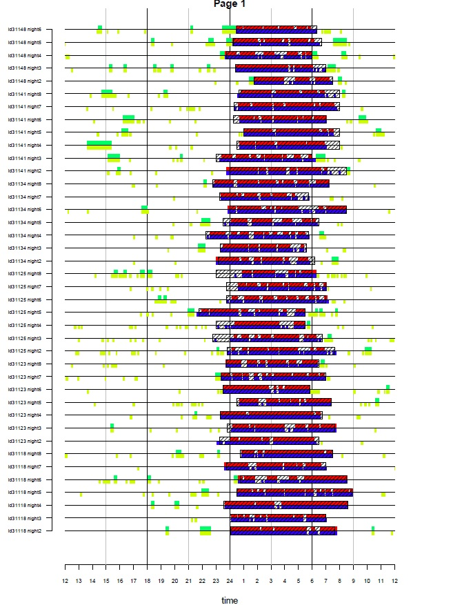

**NOTE: If you are viewing this page via CRAN note that the main GGIR documentation has been migrated to the [GGIR GitHub pages](https://wadpac.github.io/GGIR/).**

GGIR generates the following types of output:

-   csv-spreadsheets with all the variables you need for physical activity, sleep and circadian rhythm research
-   Pdfs with on each page a low resolution plot of the data per file and quality indicators
-   R objects with milestone data
-   Pdfs with a visual summary of the physical activity and sleep patterns as identified (see example below)

# GGIR Part 1

GGIR part 1, only outputs RData files which are used by GGIR part 2. The RData files are not intended for direct use by the GGIR user.

# GGIR Part 2

Part 2 generates the following output:

-   part2_summary.csv: Person level summary (see below)
-   part2_daysummary.csv: Day level summary (see below)
-   QC/data_quality_report.csv: Overview of calibration results and whether or not a file was corrupt or too short to be processed,
-   QC/plots to check data quality 1.pdf: A pdf with visualisation of the acceleration time series in 15 minute resolution and with invalid data segments highlighted in colours (yellow: non-wear based on standard deviation threshold, brown: non-wear after extra filtering step (introduced in 2013), and purple: clipping)

## Person level summary (csv)

| (Part of) variable name | Description |
|--------------------------|----------------------------------------------|
| ID | Participant id |
| device_sn | Device serial number |
| bodylocation | Body location extracted from file header |
| filename | Name of the data file |
| start_time | Timestamp when recording started |
| startday | Day of the week on which recording started |
| samplefreq | Sample frequency (Hz) |
| device | Accelerometer brand, e.g. GENEACtiv |
| clipping_score | The Clipping score: Fraction of 15 minute windows per file for which the acceleration in one of the three axis was close to the maximum for at least 80% of the time. This should be 0. |
| meas_dur_dys | Measurement duration (days) |
| complete_24hcycle | Completeness score: Fraction of 15 minute windows per 24 hours for which no valid data is available at any day of the measurement. |
| meas_dur_def_proto_day | measurement duration according to protocol (days): Measurement duration (days) minus the hours that are ignored at the beginning and end of the measurement motivated by protocol design |
| wear_dur_def_proto_day | wear duration duration according to protocol (days): So, if the protocol was seven days of measurement, then wearing the accelerometer for 8 days and recording data for 8 days will still make that the wear duration is 7 days |
| nonwear_hours_filtered | Total number of nonwear hours filtered, only stored when using parameter `nonwearFiltermaxHours` |
| nonwear_events_filtered   | Total number of nonwear events filtered, only stored when using parameter `nonwearFiltermaxHours` |
| calib_err | Calibration error (static estimate) Estimated based on all 'non-movement' periods in the measurement after applying the autocalibration. |
| calib_status | Calibration status: Summary statement about the status of the calibration error minimisation |
| ENMO_fullRecordingMean | ENMO is the main summary measure of acceleration. The value presented is the average ENMO over all the available data normalised per 24-hour cycles (diurnal balanced), with invalid data imputed by the average at similar time points on different days of the week. In addition to ENMO it is possible to extract other acceleration metrics (i.e. BFEN, HFEN, HFENplus). We emphasize that it is calculated over the full recording because the alternative is that a variable is only calculated overmeasurement days with sufficient valid hours of data. |
| ENMO | (only available if set to true in part1.R) ENMO is the main summary measure of acceleration. The value presented is the average ENMO over all the available data normalised per 24 hour cycles, with invalid data imputed by the average at similar timepoints on different days of the week. In addition to ENMO it is possible to extract other acceleration metrics in part1.R (i.e. BFEN, HFEN, HFENplus) See also [van Hees PLoSONE April 2013](https://journals.plos.org/plosone/article?id=10.1371/journal.pone.0061691) for a detailed description and comparison of these techniques. |
| pX_A_mg_0-24h_fullRecording | This variable represents the Xth percentile in the distribution of short epoch metric value A of the average day. The average day may not be ideal for describing the distribution. Therefore, the code also extracts the following variable. |
| AD_pX_A_mg_0-24h | This variable represents the Xth percentile in the distribution of short epoch metric value A per day averaged across all days. |
| L5_A_mg_0-24 | Average of metric A during the least active five\* hours in the day that is the lowest rolling average value of metric A. (\* window size is modifiable by argument `winhr`) |
| M5_A_mg_0-24 | Average of metric A during the most active five\* hours in the day that is the lowest rolling average value of metric A. (\* window size is modifiable by argument `winhr`) |
| L5hr_A_mg_0-24 | Starting time in hours and fractions of hours of L5_A_mg_0-24, where hours below 12 are incremented with 24 to create a continuous scale throughout the night (e.g. 36 = 6am) in line with numeric timeing of sleep variables in GGIR part 4 output. |
| M5hr_A_mg_0-24 | Starting time in hours and fractions of hours of M5_A_mg_0-24 |
| ig_gradient_ENMO_0 -24hr_fullRecording | Intensity gradient calculated over the full recording. |
| 1to6am_ENMO_mg | Average metric value ENMO between 1am and 6am |
| N valid WEdays | Number of valid weekend days |
| N valid WKdays | Number of valid week days |
| IS | inter daily stability. The movement count that is derived for this was an attempt to follow the original approach by Eus J. W. Van Someren (Chronobiology International. 1999. Volume 16, issue 4). |
| IV | intra daily variability. In contrast to the original paper, we ignore the epoch transitions between the end of a day and the beginning of the next day for the numerator of the equation, this to make it a true measure of intradaily variability. Same note as for IS: The movement count that is derived for this was an attempt to follow the original approach. |
| IVIS_windowsize_minutes | Sizes of the windows based on which IV and IS are calculated (note that this is modifiable) |
| IVIS_epochsize_seconds | Argument has been deprecated |
| `AD_` | All days (plain average of all available days, no weighting). The variable was calculated per day and then averaged over all the available days |
| `WE_` | Weekend days (plain average of all available days, no weighting). The variable was calculated per day and then averaged over weekend days only |
| `WD_` | Week days (plain average of all available days, no weighting). The variable was calculated per day and then averaged over week days only |
| `WWE_` | Weekend days (weighted average) The variable was calculated per day and then averaged over weekend days. Double weekend days are averaged. This is only relevant for experiments that last for more than seven days. |
| `WWD_` | Week days (weighted average) The variable was calculated per day and then averaged over week days. Double week days were averaged. This is only relevant for experiments that last for more than seven days) |
| WWD_MVPA_E5S_T100_ENMO | Time spent in moderate-to-vigorous based on 5 second epoch size and an ENMO metric threshold of 100 |
| `WWE_MVPA_E5S_B1M80%_T100_ENMO` | Time spent in moderate-to-vigorous based on a bout criteria of at least 1 minute where 80% or more of the 5 second epochs are expected to meet the threshold criteria of of 100 mg based on acceleration metric ENMO (threshold is specified with parameter `mvpathreshold`) |
| `WE_[100, 150)_mg_0-24h_ENMO` | Time spent between (and including) 100 mg and 150 (excluding 150 itself) between 0 and 24 hours (the full day) using metric ENMO data exclusion data_masking_strategy (value=1, ignore specific hours; value=2, ignore all data before the first midnight and after the last midnight) |
| `_MVPA_E5S_B1M80_T100` | MVPA calculated based on 5 second epoch setting bout duration 1 Minute and inclusion criterion of more than 80 percent. |
| `_ENMO_mg` | ENMO or other metric was first calculated per day and then average according to AD, WD, WWE, WWD |
| data exclusion data_masking_strategy | A log of the decision made when calling g.impute: value=1 mean ignore specific hours; value=2 mean ignore all data before the first midnight and after the last midnight |
| n hours ignored at start of meas (if data_masking_strategy=1, 3 or 5) | number of hours ignored at the start of the measurement (if data_masking_strategy = 1) or at the start of the `ndayswindow` (if data_masking_strategy = 3 or 5) A log of decision made in part2.R |
| n hours ignored at end of meas (if data_masking_strategy=1, 3 or 5) | number of hours ignored at the end of the measurement (if data_masking_strategy = 1) or at the end of the `ndayswindow` (if data_masking_strategy = 3 or 5). A log of decision made in part2.R |
| n hours ignored at end of meas (if data_masking_strategy = 1, 3 or 5) | number of days of measurement after which all data is ignored (if data_masking_strategy = 1, 3 or 5) A log of decision made in part2.R |
| epoch size to which acceleration was averaged (seconds) | A log of decision made in part1.R |
| pdffilenumb | Indicator of in which pdf-file the plot was stored |
| pdfpagecount | Indicator of in which pdf-page the plot was stored |
| `cosinor_` | Cosinor analysis estimates such as mes, amp, acrophase, and acrotime, as documented in the [ActCR](https://CRAN.R-project.org/package=ActCR) package. |
| `cosinorExt_` | Extended Cosinor analysis estimates such as minimum, amp, alpha, beta, acrotime, UpMesor, DownMesor, MESOR, and F_pseudo, as documented in the [ActCR](https://CRAN.R-project.org/package=ActCR) package. |
| `cosinorIV` | Cosinor analysis compatible estimate of the Intradaily Variability (IV) |
| `cosinorIS` | Cosinor analysis compatible estimate of Interdaily Stability (IS) |
| cosinor_timeOffsetHours | Offset between start time series as used and midnight |
| cosinor_mes | The mean value of the cosinor function fitted to the log transformed acceleration signal. Higher values indicate more activity. |
| cosinor_amp | The amplitude of the cosinor function fitted to the log transformed acceleration signal, corresponding to the peak of the function minus the mesor. Higher values indicate larger amplitude in the rhythm |
| cosinor_acrotime | Time at which the cosinor function fitted to the log transformed acceleration signal reaches its maximum |
| cosinor_acrophase | Acrotime expressed in radians |
| cosinor_ndays | Number of days used for the cosinor analysis. |
| cosinor_R2 | Measure of goodness of fit of the cosinor function to the log transformed acceleration signal. Higher values indicate better goodness of fit. |
| cosinorExt_minimum | (copied from ActCR documentation) Minimum value of the function |
| cosinorExt_amp | (copied from ActCR documentation) Amplitude, a measure of half the extend of predictable variation within a cycle. This represents the highest activity one can achieve. |
| cosinorExt_alpha | (copied from ActCR documentation) It determines whether the peaks of the curve are wider than the troughs: when alpha is small, the troughs are narrow and the peaks are wide; when alpha is large, the troughs are wide and the peaks are narrow. |
| cosinorExt_beta | (copied from ActCR documentation) It dertermines whether the transformed function rises and falls more steeply than the cosine curve: large values of beta produce curves that are nearly square waves. |
| cosinorExt_acrotime | (copied from ActCR documentation) acrophase is the time of day of the peak in the unit of the time (hours) |
| cosinorExt_UpMesor | (copied from ActCR documentation) Time of day of switch from low to high activity. Represents the timing of the rest- activity rhythm. Lower (earlier) values indicate increase in activity earlier in the day and suggest a more advanced circadian phase. |
| cosinorExt_DownMesor | (copied from ActCR documentation) Time of day of switch from high to low activity. Represents the timing of the rest-activity rhythm. Lower (earlier) values indicate decline in activity earlier in the day, suggesting a more advanced circadian phase. |
| cosinorExt_MESOR | (copied from ActCR documentation) A measure analogous to the MESOR of the cosine model (or half the deflection of the curve) can be obtained from mes=min+amp/2. However, it goes through the middle of the peak, and is therefore not equal to the MESOR of the cosine model, which is the mean of the data |
| cosinorExt_ndays | (copied from ActCR documentation) Number of days modeled. |
| cosinorExt_F_pseudo | (copied from ActCR documentation) Measure the improvement of the fit obtained by the non-linear estimation of the transformed cosine model |
| cosinorExt_R2 | Measure of goodness of fit of the extended cosinor function to the log transformed acceleration signal. Higher values indicate better goodness of fit. |
| phi | Indicator of auto-correlation in acceleration time series over multiple days, see [chapter 13](https://wadpac.github.io/GGIR/articles/chapter13_CircadianRhythm.html) for details. |
| SSP | Method for describing time series, see [chapter 13](https://wadpac.github.io/GGIR/articles/chapter13_CircadianRhythm.html) for details. |
| ABI | ABI measures how the activity over the observed period is balanced, see [chapter 13](https://wadpac.github.io/GGIR/articles/chapter13_CircadianRhythm.html) for details. |

## Day level summary (csv)

This is a non-exhaustive list, because most concepts have been explained in summary.csv

| (Part of) variable name | Description |
|--------------------------|----------------------------------------------|
| ID | Participant id |
| filename | Name of the data file |
| calender_date | Timestamp and date on which measurement started |
| bodylocation | Location of the accelerometer as extracted from file header |
| N valid hours | Number of hours with valid data in the day |
| N hours | Number of hours of measurement in a day, which typically is 24, unless it is a day on which the clock changes (DST) resulting in 23 or 25 hours. The value can be less than 23 if the measurement started or ended this day |
| weekday | Name of weekday |
| measurement | Day of measurement Day number relative to start of the measurement |
| L5hr_ENMO_mg_0-24h | Hour on which L5 starts for these 24 hours (defined with metric ENMO) |
| L5_ENMO_mg_0-24h | Average acceleration for L5 (defined with metric ENMO) |
| `[A,B)_mg_0-24h_ENMO` | Time spent in minutes between (and including) acceleration value A in mg and (excluding) acceleration value B in mg based on metric ENMO |
| ig_gradient_ENMO_0-24hr | Gradient from intensity gradient analysis proposed by [Rowlands et al. 2018](https://journals.lww.com/acsm-msse/Fulltext/2018/06000/Beyond_Cut_%20Points__Accelerometer_Metrics_that.25.aspx) based on metric ENMO for the time segment 0 to 24 hours |
| ig_intercept_ENMO_0-24hr | Intercept from intensity gradient analysis proposed by [Rowlands et al. 2018](https://journals.lww.com/acsm-msse/Fulltext/2018/06000/Beyond_Cut_%20Points__Accelerometer_Metrics_that.25.aspx) based on metric ENMO for the time segment 0 to 24 hours |
| ig_rsquared_ENMO_0-24hr | r squared from intensity gradient analysis proposed by [Rowlands et al. 2018](https://journals.lww.com/acsm-msse/Fulltext/2018/06000/Beyond_Cut_%20Points__Accelerometer_Metrics_that.25.aspx) based on metric ENMO for the time segment 0 to 24 hours |

## Data_quality_report (csv)

The data_quality_report.csv is stored in subfolder folder results/QC.

| (Part of) variable name | Description |
|--------------------------|----------------------------------------------|
| filename | file name |
| file.corrupt | Is file corrupt? TRUE or FALSE (mainly tested for GENEActiv bin files) |
| file.too.short | File too short for processing? ([definition](#Minimum_recording_duration)) TRUE or FALSE |
| use.temperature | Temperature used for auto-calibration? TRUE or FALSE |
| scale.x | Auto-calibration scaling coefficient for x-axis (same for y and z axis, not shown here) |
| offset.x | Auto-calibration offset coefficient for x-axis (same for y and z axis, not shown here) |
| temperature.offset.x | Auto-calibration temperature offset coefficient for x-axis (same for y and z axis, not shown here) |
| cal.error.start | Calibration error prior to auto-calibration |
| cal.error.end | Calibration error after auto-calibration |
| n.10sec.windows | Number of 10 second epochs used as sphere data in auto-calibration |
| n.hours.considered | Number of hours of data considered for auto-calibration |
| QCmessage | Character QC message at the end of the auto-calibration |
| mean.temp | Mean temperature in sphere data |
| device.serial.number | Device serial number |
| NFilePagesSkipped | (Only for Axivity .cwa format) Number of raw data blocks skipped |
| filehealth_totimp_min | (Only for Axivity .cwa, ActiGraph gt3x, and ad-hoc csv format) Total number of minutes of raw data imputed |
| filehealth_checksumfail_min | (Only for Axivity .cwa format) Total number of minutes of raw data where the checksum failed |
| filehealth_niblockid_min | (Only for Axivity .cwa format) Total number of minutes of raw data with non-incremental block ids |
| filehealth_fbias0510_min | (Only for Axivity .cwa format) Total number of minutes with a sampling frequency bias between 5 and 10% |
| filehealth_fbias1020_min | (Only for Axivity .cwa format) Total number of minutes with a sampling frequency bias between 10 and 20% |
| filehealth_fbias2030_min | (Only for Axivity .cwa format) Total number of minutes with a sampling frequency bias between 20 and 30% |
| filehealth_fbias30_min | (Only for Axivity .cwa format) Total number of minutes with a sampling frequency bias higher than 30% |
| filehealth_totimp_N | (Only for Axivity .cwa, ActiGraph gt3x, and ad-hoc csv format) Total number of data blocks that were imputed |
| filehealth_checksumfail_N | (Only for Axivity .cwa format) Total number of blocks where the checksum failed |
| filehealth_niblockid_N | (Only for Axivity .cwa format) Total number of raw data blocks with non-incremental block ids |
| filehealth_fbias0510_N | (Only for Axivity .cwa format) Total number of raw data blocks with a sampling frequency bias between 5 and 10% |
| filehealth_fbias1020_N | (Only for Axivity .cwa format) Total number of raw data blocks with a sampling frequency bias between 10 and 20% |
| filehealth_fbias2030_N | (Only for Axivity .cwa format) Total number of raw data blocks with a sampling frequency bias between 20 and 30% |
| filehealth_fbias30_N | (Only for Axivity .cwa format) Total number of raw data blocks with a sampling frequency bias higher than 30% |

# GGIR Part 3

GGIR part 3, only outputs RData files which are used by GGIR part 4 and 5. The RData files are not intended for direct use by the GGIR user.

# GGIR Part 4

Part 4 generates the following output:

## Night level summaries (csv)

-   part4_nightsummary_sleep_cleaned.csv
-   QC/part4_nightsummary_sleep_full.csv

The latter with '\_full' in the name is intended to aid clarifying why some nights (if any) are excluded from the cleaned summary report. Although, nights where the accelerometer was not worn at all are excluded from this. So, if you have a 30 day recording where the accelerometer was not worn from day 7 onward then you will not find the last 22 nights in either csv-report.

The csv. files contain the variables as shown below.

| (Part of) variable name | Description |
|--------------------------|----------------------------------------------|
| ID | Participant ID extracted from file |
| night | Number of the night in the recording |
| sleeponset | Detected onset of sleep expressed as hours since the midnight of the previous night. |
| wakeup | Detected waking time (after sleep period) expressed as hours since the midnight of the previous night. |
| SptDuration | Difference between onset and waking time. |
| sleepparam | Definition of sustained inactivity by accelerometer. |
| guider | guider used as discussed in paragraph [Sleep analysis](#Sleep_analysis). |
| guider_onset | Start of Sleep Period Time window derived from the guider. |
| guider_wake | End of Sleep Period Time window derived guider. |
| guider_SptDuration | Time SPT duration derived from guider_wake and guider_onset. |
| error_onset | Difference between sleeponset and guider_onset |
| error_wake | Difference between wakeup and guider_wake |
| fraction_night_invalid | Fraction of the night (noon-noon or 6pm-6pm) for which the data was invalid, e.g. monitor not worn or no accelerometer measurement started/ended within the night. |
| SleepDurationInSpt | Total sleep duration, which equals the accumulated nocturnal sustained inactivity bouts within the Sleep Period Time. |
| duration_sib_wakinghours | Accumulated sustained inactivity bouts during the day. These are the periods we would label during the night as sleep, but during the day they form a subclass of inactivity, which may represent day time sleep or wakefulness while being motionless for a sustained period of time number_sib_sleepperiod} Number of nocturnal sleep periods, with nocturnal referring to the Sleep Period Time window. |
| duration_sib_wakinghours_atleast15min | Same as duration_sib_wakinghours, but limited to SIBs that last at least 15 minutes. |
| num ber_sib_wakinghours | Number of sustained inactivity bouts during the day, with day referring to the time outside the Sleep Period Time window. |
| sleeponset_ts | sleeponset formatted as a timestamp |
| wakeup_ts | wakeup formatted as a timestamp |
| guider_onset_ts | guider_onset formatted as a timestamp |
| guider_wake_ts | guider_wake formatted as a timestamp |
| page | pdf page on which the visualisation can be found |
| daysleeper | If 0 then the person is a nightsleeper (sleep period did not overlap with noon) if value=1 then the person is a daysleeper (sleep period did overlap with noon) |
| weekday | Day of the week on which the night started |
| calendardate | Calendar date on which the night started in day/month/year format. |
| filename | Name of the accelerometer file |
| cleaningcode | see paragraph [Cleaningcode](https://wadpac.github.io/GGIR/articles/chapter10_SleepAnalysis.html#cleaningcode) |
| sleeplog_used | Whether a sleep log was used (TRUE/FALSE) |
| acc_available | Whether accelerometer data was available (TRUE/FALSE). |
| WASO | Wake After Sleep Onset: SptDuration - SleepDurationInSpt |
| SptDuration | Sleep Period Time window duration: wakeup - sleeponset |
| error_onset | Difference between sleeponset and guider_onset (this variable is only available in the full report as stored in the QC folder) |
| error_wake | Difference between wakeup and guider_wake (this variable is only available in the full report as stored in the QC folder) |
| SleepRegularityIndex | The Sleep Regularity Index as proposed by [Phillips et al. 2017](https://www.nature.com/articles/s41598-017-03171-4), but calculated per day-pair to enable user to study patterns across days |
| SriFractionValid | Fraction of the 24 hour period that was valid in both current as well as in matching timestamps for the next calendar day. See GGIR function manual for details |
| nonwear_perc_spt | Non-wear percentage during the spt hours of this day. This is a copy of the nonwear_perc_spt calculated in `part 5`, only included in part 4 reports if part 5 has been run with timewindow = WW |

**Non-default variables in part 4 csv report**

These additional are only stored if you used a sleeplog that captures time in bed, or when using guider HorAngle for hip-worn accelerometer data. If either of these applies set argument `sleepwindowType` to "TimeInBed".

| (Part of) variable name | Description |
|--------------------------|----------------------------------------------|
| guider_guider_inbedStart | Time of getting in bed |
| guider_guider_inbedEnd | Time of getting out of bed |
| guider_inbedDuration | Time in Bed: guider_inbedEnd - guider_inbedStart |
| sleepefficiency | Sleep efficiency, calculated by one of two metrics as controlled by argument `sleepefficiency.metric`: SleepDurationInSpt / guider_inbedDuration (default) or SleepDurationInSpt / (SptDuration + latency) |
| sleeplatency | Sleep latency, calculated as: sleeponset - guider_inbedStart |

## Person level summaries (csv)

-   part4_summary_sleep_cleaned.csv
-   QC/part4_summary_sleep_full.csv

In the person level report the variables are derived from the variables in the night level summary. Minor extensions to the variable names explain how variables are aggregated across the days. Please find below extra clarification on a few of the variable names for which the meaning may not be obvious:

| (Part of) variable name | Description |
|--------------------------|----------------------------------------------|
| `_mn` | mean across days |
| `_sd` | standard deviation across days |
| `_AD` | All days |
| `_WE` | Weekend days |
| `_WD` | Week days |
| sleeplog_used | Whether a sleeplog was available (TRUE) or not (FALSE) |
| sleep_efficiency_after_onset | Accelerometer derived sleep efficiency within the sleep period time calculated as the ratio between acc_SleepDurationInSpt and guider_SptDuration (denominator) or acc_SleepDurationInSpt and acc_SptDuration + latency (denominator), as defined with sleepefficiency.metric. Only available at person level, because at night level the user can calculate this from existing variables. |
| n_nights_acc | Number of nights of accelerometer data |
| n_nights_sleeplog | Number of nights of sleeplog data. |
| n_WE_nights_complete | Number of weekend nights complete which means both accelerometer and estimate from guider. |
| n_WD_nights_complete | Number of weekday nights complete which means both accelerometer and estimate from guider. |
| n_WEnights_daysleeper | Number of weekend nights on which the person slept until after noon. |
| n_WDnights_daysleeper | Number of weekday nights on which the person slept until after noon. |
| duration_sib_wakinghour | Total duration of sustained inactivity bouts during the waking hours. |
| number_sib_wakinghours | Number of sustained inactivity bouts during the waking hours. |
| average_dur_sib_wakinghours | Average duration of the sustained inactivity bouts during the day (outside the sleep period duration). Calculated as duration_sib_wakinghour divided by number_sib_wakinghours per day, after which the mean and standard deviation are calculated across days. |

## Visualisation (pdf)

Visualisation to support data quality checks: - visualisation_sleep.pdf (optional)

When input argument `do.visual` is set to TRUE GGIR can show the following visual comparison between the time window of being asleep (or in bed) according to the sleeplog and the detected sustained inactivity bouts according to the accelerometer data. This visualisation is stored in the results folder as `visualisation_sleep.pdf`.

Explanation of the image: Each line represents one night. Colours are used to distinguish definitions of sustained inactivity bouts (2 definitions in this case) and to indicate existence or absence of overlap with the sleeplog. When argument `outliers.only` is set to FALSE it will visualise all available nights in the dataset. If `outliers.only` is set to TRUE it will visualise only nights with a difference in onset or waking time between sleeplog and sustained inactivity bouts larger than the value of argument `criterror`.

This visualisation with outliers.only set to TRUE and critererror set to 4 was very powerful to identify entry errors in sleeplog data in van Hees et al PLoSONE 2015. We had over 25 thousand nights of data, and this visualisation allowed us to quickly zoom in on the most problematic nights to investigate possible mistakes in GGIR or mistakes in data entry.

```{r, out.width = "700px",echo=FALSE, fig.alt="Example visualisation GGIR part 4"}

```

# GGIR Part 5

The output of part 5 is dependent on the parameter configuration, it will generate as many output files as there are unique combination of the three thresholds provided.

For example, the following files will be generated if the threshold configuration was 30 for light activity, 100 for moderate and 400 for vigorous activity:

-   part5_daysummary_MM_L30M100V400_T5A5.csv
-   part5_daysummary_WW_L30M100V400_T5A5.csv
-   part5_personsummary_MM_L30M100V400_T5A5.csv
-   part5_personsummary_WW_L30M100V400_T5A5.csv
-   file summary reports/Report_nameofdatafile.pdf

## Day level summary (csv)

| (Term in) variable name | Description |
|--------------------------|----------------------------------------------|
| sleeponset  | onset of sleep expressed in hours since the midnight in the night preceding the night of interest, e.g. 26 is 2am.        |
| wakeup      | waking up time express in the same way as sleeponset.       |
| sleeponset_ts           | onset of sleep expressed as a timestamp hours:minutes:seconds           |
| daysleeper  | if 0 then the person woke up before noon, if 1 then the person woke up after noon    |
| cleaningcode| See paragraph [Cleaningcode](https://wadpac.github.io/GGIR/articles/chapter10_SleepAnalysis.html#cleaningcode).   |
| dur_day_spt_min         | Total length of daytime waking hours and spt combined (typically 24 hours for MM report).        |
| `dur_`      | duration of a behavioral class that will be specified int he rest of the variable name           |
| `ACC_`      | (average) acceleration according to default metric specific by acc.metric|
| `_spt_wake_`| Wakefulness within the Sleep period time window.|
| `_spt_sleep_`           | Sleep within the Sleep period time window.     |
| `_IN_`      | Inactivity. Note that we use the term inactivity instead of sedentary behaviour for the lowest intensity level of behaviour. The reason for this is that GGIR does not attempt to classifying the activity type sitting at the moment, by which we feel that using the term sedentary behaviour would fail to communicate that.|
| `_LIG_`     | Light activity        |
| `_MOD_`     | Moderate activity     |
| `_VIG_`     | Vigorous activity     |
| `_MVPA_`    | Moderate or Vigorous activity      |
| `_unbt_`    | Unbouted  |
| `_bts_`     | Bouts (also known as sojourns), which are segments that for which the acceleration is within a specified range for a specified fraction of the time.|
| `_bts_1_10_`| Bouts lasting at least 1 minute and less than 10 minutes (1 and 9.99 minutes are included, but 10 minutes is not).        |
| Nblock      | number of blocks of a certain behavioral class, not these are not bouts but a count of the number of times the behavioral class occurs without interruptions.   |
| WW          | in filename refers to analyses based on the timewindow from waking to waking up      |
| MM          | in filename refers to analyses done on windows between midnight and midnight         |
| calendar_date           | calendar date on which the window started in day/month/year format. So, for WW window this could mean that you have two windows starting on the same date.      |
| weekday     | weekday on which the window started. So, for WW window this could mean that you have two windows starting on the weekday. |
| `_total_IN` | total time spent in inactivity (no distinction between bouted or unbouted behavior, this is a simple count of the number of epochs that meet the threshold criteria.        |
| `_total_LIG`| total time spent in light activity.|
| nonwear_perc_day        | Non-wear percentage during the waking hours of this day.    |
| nonwear_perc_spt        | Non-wear percentage during the spt hours of this day.       |
| nonwear_perc_day_spt    | Non-wear percentage during the whole day, including waking and spt.     |
| dur_day_min | Duration of waking hours within this day window|
| dur_spt_min | Duration of Sleep Period Time within this day window.       |
| dur_day_spt_min         | Duration this day window, including both waking hours and SPT.          |
| sleep_efficiency_after_onset        | sleep_efficiency_after_onset in part 5 is not the same as in part 4, but calculated as the percentage of sleep within the sleep period time window. The conventional approach is the approach used in part 4.    |
| L5TIME      | Timing of least active 5hrs, expressed as timestamp in the day          |
| M5TIME      | Timing of most active 5hrs         |
| L5TIME_num, M5TIME_num  | Timing of least/most active 5hrs, expressed as hours in the day. Note that L5/M5 timing variables are difficult to average across days because 23:00 and 1:00 would average to noon and not to midnight. So, caution is needed when interpreting person averages.   |
| L5VALUE     | Acceleration value for least active 5hrs       |
| M5VALUE     | Acceleration value for most active 5hrs        |
| `ig_`       | All variables related to intensity gradient analysis |
| `_gradient`   | Gradient from intensity gradient analysis proposed by [Rowlands et al. 2018](https://journals.lww.com/acsm-msse/Fulltext/2018/06000/Beyond_Cut_%20Points__Accelerometer_Metrics_that.25.aspx) for the waking hours window (`_day_`) and for the full window (`_day_spt_`)      |
| `_intercept`  | Intercept from intensity gradient analysis proposed by [Rowlands et al. 2018](https://journals.lww.com/acsm-msse/Fulltext/2018/06000/Beyond_Cut_%20Points__Accelerometer_Metrics_that.25.aspx) for the waking hours window (`_day_`) and for the full window (`_day_spt_`)      |
| `_rsquared`   | r squared from intensity gradient analysis proposed by [Rowlands et al. 2018](https://journals.lww.com/acsm-msse/Fulltext/2018/06000/Beyond_Cut_%20Points__Accelerometer_Metrics_that.25.aspx) for the waking hours window (`_day_`) and for the full window (`_day_spt_`)      |
| `FRAG_`     | All variables related to behavioural fragmentation analysis |
| `TP_`       | Transition probability|
| PA2IN       | Physical activity fragments followed by inactivity fragments|
| IN2PA       | Physical inactivity fragments followed by activity fragments|
| Nfrag       | Number of fragments   |
| IN2LIPA     | Inactivity fragments followed by LIPA          |
| IN2MVPA     | Inactivity fragments followed by MVPA          |
| `mean_dur`  | mean duration of a fragment category           |
| `Gini_dur`  | Gini index|
| `CoV_dur`   | Coefficient of Variation           |
| alpha       | Power law exponent    |
| `x0.5`      | Derived from power law exponent alpha, see [Chastin et al. 201 0](https://doi.org/10.1016/j.gaitpost.2009.09.002)        |
| `W0.5`      | Derived from power law exponent alpha, see [Chastin et al. 201 0](https://doi.org/10.1016/j.gaitpost.2009.09.002)        |
| nap_count   | Total number of naps, only calculated when argument do.sibreport = TRUE, currently optimised for 3.5-year olds. See function documentation for function `g.part5.classifyNaps` in the [GGIR function documentation (pdf)](https:/CRAN.R-project.org/package=GGIR/GGIR.pdf). |
| nap_totalduration       | Total nap duration, only calculated when argument do.sibreport = TRUE, currently optimised for 3.5-year old. See function documentation for function `g.part5.classifyNaps` in the [GGIR function documentation (pdf)](https:/CRAN.R-project.org/package=GGIR/GGIR.pdf).    |
| sibreport_n_items	| Only created if `do.sibreport = TRUE`. Number of items in the sibreport |
| sibreport_n_items_day |	Only created if `do.sibreport = TRUE`. Number of items in the sibreport for this specific day |
| nbouts_X | Only created if `do.sibreport = TRUE`. Number of bouts in a day of X where X can be a detected nap (denap), srnap (self-reported nap) or srnonw (self-reported nonwear) |
| noverl_X | Only created if `do.sibreport = TRUE`. Number of overlapping bouts in a day of X where X can be denap_srnap, denap_srnonw, srnap_denap, or srnonw_denap |
| frag_mean_dur_X_day | Only created if `do.sibreport = TRUE`. Mean duration of X per day, where X can be sib, srnap or srnonw |
| dur_X_min | Only created if `do.sibreport = TRUE`. Total duration in minutes of X per day, where X can be detect nap (denap), srnap or srnonw |
| mdur_X_overl_Y | Only created if `do.sibreport = TRUE`. Mean duration of the overlap between X and Y, which are combinations of denap, srnap or srnonw |
| tdur_X_overl_Y | Only created if `do.sibreport = TRUE`. Total duration in minutes of the overlap between X and Y, which are combinations of denap, srnap or srnonw |
| perc_X_overl_Y | Only created if `do.sibreport = TRUE`. Percentage of overlap between X and Y, which are combinations of denap, srnap or srnonw |

**Special note if you are working on compositional data analysis:**

The duration of all `dur_` variables that have `_total_` in their name should add up to the total length of the waking hours in a day. Similarly, the duration of all other `dur_` variables excluding the variables `_total_` in their name and excluding the variable with `dur_day_min`, `dur_spt_min`, and `dur_day_spt_min` should also add up to the length of the full day.

**Motivation for default boutcriter.in = 0.9:**

The idea is that if you allow for bouts of 30 minutes it would not make sense to allow for breaks of 20 percent (6 minutes!) this is why I used a more stringent criteria for the highest category. Please note that you can change these criteria via arguments `boutcriter.mvpa`, `boutcriter.in`, and `boutcriter.lig`.

## Person level summary (csv)

Most variables in the person level summary are derived from the day level summary, but extended with `_pla` to indicate that the variable was calculated as the plain average across all valid days. Variables extended with `_wei` represent the weighted average of across all days where weekend days always weighted 2/5 relative to the contribution of week days.

| Variable name | Description |
|--------------------------|----------------------------------------------|
| Nvaliddays | Total number of valid days. |
| Nvaliddays_WD | Number of valid week days. |
| Nvaliddays_WE | Number of valid weekend days, where the days that start on Saturday or Sunday are considered weekend. |
| NcleaningcodeX | Number of days that had cleaning code X for the corresponding sleep analysis in part 4. In case of MM analysis this refers to the night at the end of the day. |
| Nvaliddays_AL10F_WD | Number of valid week days with at least 10 fragments (5 inactivity or 5 inactive) |
| Nvaliddays_AL10F_WE | Number of valid weekend days with at least 10 fragments (5 inactivity or 5 inactive) |
| `_wei` | weighted average of weekend and week days, using a 2/5 ratio, see above. |
| `_pla` | plain average of all days, see above |
