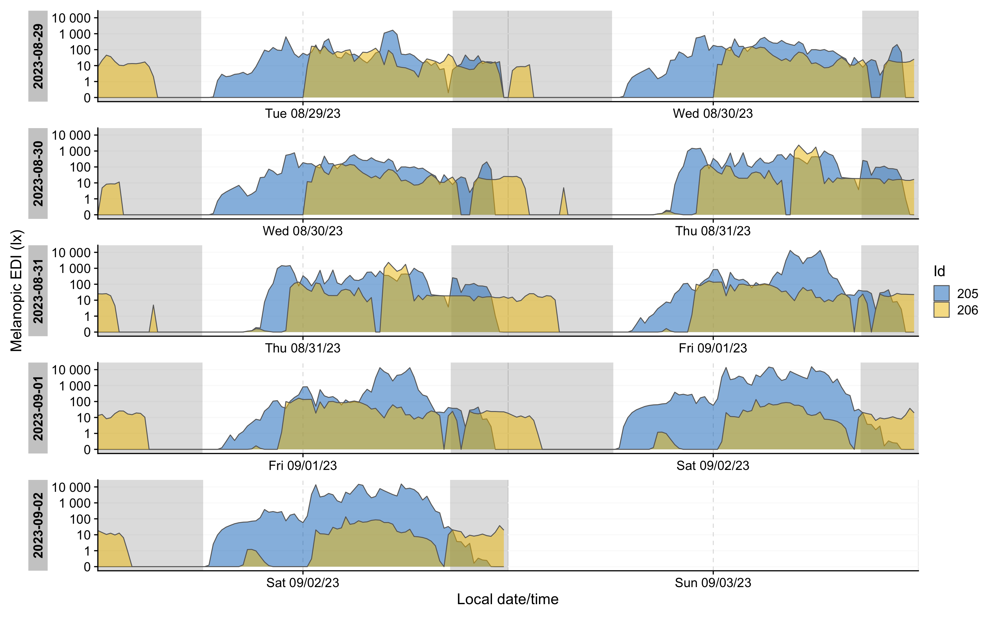
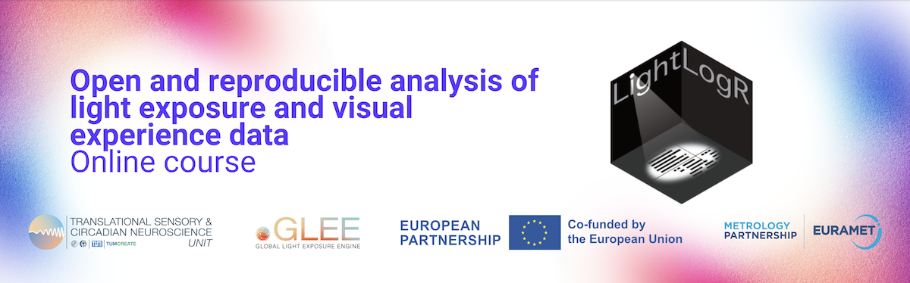

```{r setup, include=FALSE}
knitr::opts_chunk$set(echo = TRUE)
```

# Introduction

Personal light exposure, assessed with wearable dosimeters and light loggers, is gaining importance. Many accelerometers as used in research have a light sensor. In this vignette we discuss what GGIR complemented by LightLogR can do with these data.

## Basic light exposure analysis with GGIR

GGIR offers only limited functionality to analyse these data. Firstly, Lux sensors are typically scaled in the factory, but can be exponentially rescaled with parameters [LUX_cal_constant](https://wadpac.github.io/GGIR/articles/GGIRParameters.html#lux_cal_constant) and [LUX_cal_exponent](https://wadpac.github.io/GGIR/articles/GGIRParameters.html#lux_cal_exponent). Next, the values are aggregated as lightmean and lightpeak per long epoch (default long epoch size is 15 minutes), respectively reflecting mean and maximum value.

The lightpeak values are shown in the visualisations as save to [.png files](https://wadpac.github.io/GGIR/articles/chapter2_Pipeline.html#ggir-output) by GGIR part 2 and generated based on parameter [visualreport](https://wadpac.github.io/GGIR/articles/GGIRParameters.html?q=visualreport#visualreport).

Further, in GGIR part 5 we derive some summary statistics per recording day:

- Time spent in LUX range specified with parameter [LUXthresholds](https://wadpac.github.io/GGIR/articles/GGIRParameters.html#luxthresholds).
- Day segment for which lux analysis should be performed are specified with parameter [LUX_day_segments](https://wadpac.github.io/GGIR/articles/GGIRParameters.html#lux_day_segments)

## Advanced light exposure analysis with LightLogR

R package [LightLogR](https://tscnlab.github.io/LightLogR/index.html) offers a much more in-dept analysis of personal light exposure and has been developed by a community of experts in the field. In this vignette we will document how GGIR epoch level output can be used as input for LightLogR.

Practical notes before we start:

- This vignette uses functions from various other packages. Each function is preceded by `packageName::` to clarify to which package the function belongs to. In your own code you do not have to do this as long as you load the package with `library(packageName)`.
- LightLogR works best with real life multi-day example recordings. GGIR does not offers example raw data files as those are too large to include in software. Therefore, all of the code examples below do not run out of the box but depend on you having access to one or multiple raw data accelerometer files with light sensor data.

# Installation of LightLogR

You can install LightLogR from [CRAN](https://cran.r-project.org/package=LightLogR) with

```{r, eval=FALSE}
install.packages("LightLogR")
```

For further details on installation see original [LightLogR documentation](https://tscnlab.github.io/LightLogR/#installation).

# Prepare GGIR data

LightLogR can use the light sensor data extracted with GGIR part 1 and stored in the corresponding milestone data. By default the light sensor data in the GGIR output has a low resolution. However, in the context of luminious exposure research it is advisable to increase the resolution. We can do this with parameter [`windowsizes`](https://wadpac.github.io/GGIR/articles/GGIRParameters.html#windowsizes). In the example below we use a 60 second resolution, but feel free to choose an even lower value, but not lower than the first value of the vector as specified by `windowsizes`.

## Folder with exclusively accelerometer file(s)

If the folder contains one or multiple GENEActiv files in its root or in any of its subfolders and no other file type you can use GGIR as:

```{r, eval=FALSE}
my_GENEActiv_datafolder = "D:/studyX"

outputdir = "."

library(GGIR)
GGIR::GGIR(datadir = my_GENEActiv_datafolder,
     outputdir = outputdir,
     mode = 1,
     desiredtz = "Europe/Amsterdam",
     windowsizes = c(5, 60, 3600))
```

In this example we set the epoch size for light sensor data to be aggregated at 60 seconds. GGIR creates an output folder that references the name of the data folder: `./output_studyX`, as discussed [elsewhere](https://wadpac.github.io/GGIR/articles/chapter2_Pipeline.html).

Note that we declare that accelerometers were configured and used in the timezone `"Europe/Amsterdam"` by specifying parameter [desiredtz](https://wadpac.github.io/GGIR/articles/GGIRParameters.html#desiredtz) and leaving parameter [configtz](https://wadpac.github.io/GGIR/articles/GGIRParameters.html#configtz) unspecified.

## Accelerometer file(s) mixed with other file types

If you want to process one or multiple specific files that are stored in one or multiple folders that also hold other file types then provide a character vector of paths to filenames.

```{r, eval=FALSE}
my_GENEActiv_files = c("D:/studyX/1_recording.bin", "D:/studyX/2_recording.bin")
outputdir = "."

library(GGIR)
GGIR::GGIR(datadir = my_GENEActiv_files,
     outputdir = outputdir,
     mode = 1,
     desiredtz = "Europe/Amsterdam",
     windowsizes = c(5, 10, 3600),
     studyname = "studyX")
```

Note that in this case we need to specify parameter `studyname` to tell GGIR to store all output in a new to be created folder `./output_studyX`. In the previous example this was not needed, because GGIR deduced the study name from the name of the folder in which the data is stored.

See [GGIR documentation pages](https://wadpac.github.io/GGIR) for a more elaborate discussion of all other GGIR functionalities.

# Providing GGIR output to LightLogR

To import the GENEActiv data do the following.

```{r, eval=FALSE}
library(LightLogR)
filename = "output_test"
dataset <- LightLogR::import$GENEActiv_GGIR(filename, tz = "Europe/Amsterdam")
```

Please note that `import` is one of LightLogR's object functions and not an typical R object as the `$` may suggest. So, do not be confused by the `$`. This is just how LightLogR is able to facilitate a variety of data formats.

LightLogR has been tested with GENEActiv data, but in theory it can work with any accelerometer file that has been processed with GGIR and contains light sensor data. Use `import$GENEActiv_GGIR` even when the actual accelerometer name processed by GGIR is not GENEActiv.

# Exploring the data with LightLogR

If there are multiple recordings of one week in dataset, you can create a doubleplot for a week of data with the folowing code:

```{r, eval=FALSE}

library(lubridate)
library(dplyr)

dataset %>% 
  LightLogR::filter_Date(length = "5 days", full.day = TRUE) %>% #restrict data length
  dplyr::ungroup() %>% #remove Id-grouping, so they both are plotted over another
  LightLogR::gg_doubleplot(y.axis = lightmean, #y-value
                aes_fill = Id, #coloring by Id
                jco_color = TRUE, #choosing the jco color palette
                alpha = 0.5, #transparency
                y.axis.label = "Illuminance (lx)" #y-axis label
                ) %>%
  LightLogR::gg_photoperiod( #adding photoperiod indicators (grey for nighttime)
    c(48.5, 9) #coordinates of the measurement
    ) 
```



Also, we can calculate light metrics. In the example below we derive Time above 250 lx threshold for each participant.

```{r, eval=FALSE}
dataset %>% 
  dplyr::group_by(Day = lubridate::date(Datetime), .add = TRUE) %>% #calculating metrics by day
  #calculating metrics
  dplyr::summarize(
  duration_above_threshold(lightmean, Datetime, threshold = 250, as.df = TRUE),
  bright_dark_period(MEDI, Datetime, as.df = TRUE),
  .groups = "drop_last"
  ) %>% 
  #calculating the average and standard deviation of the TAT250
  dplyr::summarize(TAT250_average = mean(duration_above_250) %>% 
                     round() %>%  lubridate::as.duration(),
                   TAT250_sd = sd(duration_above_250) %>% 
                     round() %>% lubridate::as.duration(),
                   M10_mean = mean(brightest_10h_mean)
                   )
```

| **Id** | **TAT250_average**    | **TAT250_sd**           | M10_mean |
|:-------|:----------------------|:------------------------|----------|
| 205    | 17100s (\~4.75 hours) | 9310s (\~2.59 hours)    | 1307.316 |
| 206    | 1080s (\~18 minutes)  | 2415s (\~40.25 minutes) | 83.013   |

# Working with LightLogR

For more information on visualizations, metrics, processing options, see the [**LightLogR vignettes**](<https://tscnlab.github.io/LightLogR/articles/>), or [**LightLogR documentation page**](<https://tscnlab.github.io/LightLogR/>).

The interactive online course on the [**Open and reproducible analysis of light exposure and visual experience data**](https://tscnlab.github.io/LightLogR_webinar/) provides a quick and low-effort entrypoint to LightLogR, as it has tutorials that run completely in the browser, no installation or setup required.

[](https://tscnlab.github.io/LightLogR_webinar/)
